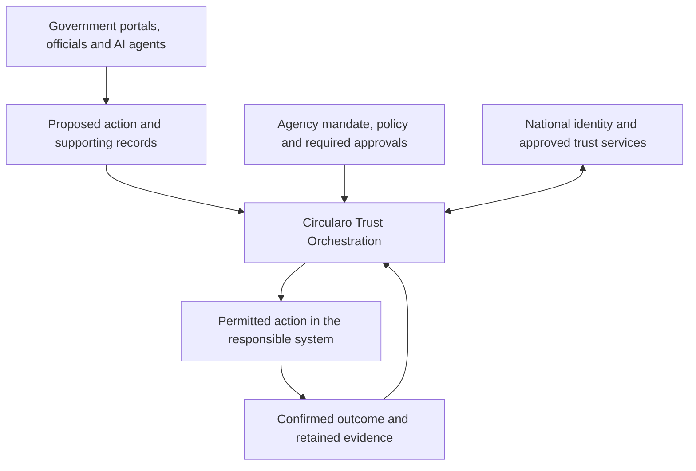

# Circularo positioning for trusted agentic AI in UAE government

**Internal executive discussion draft · 30 September 2026**  
**Audience:** Digital Dubai Authority (DDA), the Telecommunications and Digital Government Regulatory Authority (TDRA), and government service and operations leaders.  
**Status:** Proposed positioning and use cases, not an approved product specification or external claim. The [evidence and capability notes](evidence-and-capability-notes.md) distinguish documented foundations from capabilities requiring validation.

Circularo should position itself as a **Trust Orchestration Platform for government actions initiated by people, applications and AI agents**. Its strategic role is to connect a proposed action to the authority, approvals, trust services and evidence required to complete it responsibly.

The executive proposition is simple: **help government turn AI capability into authorized action, with evidence of what actually happened.**

## Why this matters to UAE government

The UAE has announced a framework targeting the transition of half of government sectors and services to agentic AI within two years. This is an announced ambition, not a measure of completed deployment. It creates a timely question for leaders: how should an agent's ability to act be connected to the government's authority to act? [UAE government framework announcement](https://www.mediaoffice.ae/en/news/2026/april/23-04/mohammed-bin-rashid-chairs-uae-cabinet-meeting).

Dubai's AI Policy for Government Entities establishes a governance framework emphasizing explainability, human-centricity and interoperability. Our strategic interpretation is that these principles need to become visible in each consequential service transaction: who authorized it, what was approved, and how the outcome can be reviewed. [Digital Dubai policy announcement](https://www.digitaldubai.ae/newsroom/hamdan-bin-mohammed-reviews-first-edition-of-dubai-state-of-ai-report).

An agent may prepare a permit, assemble a procurement recommendation or draft an official response. Each becomes a different proposition when it changes an official record, commits public funds or communicates a binding decision. **Intelligence does not create institutional authority.**

## Where Circularo fits

The proposed role sits at the point where an AI recommendation becomes an action with institutional consequences. Circularo would coordinate the content, authorized participants, approval process, required signing or sealing, and evidence around that action, using supported integrations.

*Proposed architecture. Agent controls and each integration require validation; the diagram does not describe a released end-to-end service.*

AI platforms supply reasoning and task planning. Agencies retain their statutory powers and decision rights. National infrastructure supplies identity and applicable trust services. Business systems remain responsible for their authoritative transactions. Circularo's opportunity is to connect these responsibilities into a process that can be explained and evidenced.

That is a credible extension of its documented foundations: Circularo's help center describes UAE PASS authentication, recipient verification and signing, as well as shared services for signing, approvals and document workflows. These are vendor-documented capabilities; suitability for a particular government deployment still needs confirmation. [UAE PASS integration](https://help.circularo.com/en/uae-pass-integration), [shared services documentation](https://help.circularo.com/en/shared-services-q-a).

The proposed differentiation is the connection between **the exact content, the authority to act, the decision and the confirmed outcome**. This gives executives a concrete way to evaluate Circularo beyond an isolated signing event.

## The proposition for DDA

**Make trusted agentic execution reusable across Dubai government, while each entity retains authority over its own decisions.**

The proposed discussion with DDA is a shared capability that entities could use within their services and internal operations. Common process patterns could define how an agent submits work, how an authorized official approves it, how the required trust service is invoked, and how the outcome is recorded.

Each entity would retain its mandate, decision thresholds, records ownership and access boundaries. A shared operator would provide the agreed service and operating controls. This could reduce repeated integration work and make oversight more consistent; those benefits should be measured in a pilot.

**Suggested executive message:** “Circularo proposes a common way for Dubai entities to connect AI-initiated work to official authority and evidence. Start with a repeatable process, prove its controls, and make the validated pattern available to other entities.”

## The proposition for TDRA

**Connect federal digital enablers and the trust-services ecosystem to accountable agentic government processes.**

TDRA describes its digital government role across national platforms, integration and digital identity, including the Government Service Bus, UAE API Marketplace and UAE PASS. This makes compatibility with existing national enablers a relevant design objective. It does not establish that Circularo already integrates with each of them. [TDRA digital government responsibilities](https://tdra.gov.ae/en/About/tdra-sectors/information-and-digital-government).

The proposed engagement has two distinct parts: explore a reusable execution pattern with digital government teams, and establish the applicable trust-service requirements with the responsible specialists. TDRA's regulatory role and any procurement or service-operation role remain separate. Its framework distinguishes licensed trust service providers and qualified trust service providers; Circularo's proposed orchestration role does not establish either status. [TDRA trust services guidance](https://tdra.gov.ae/en/About/tdra-sectors/information-and-digital-government/departments/policy-and-programs-department/trust-services/faqs).

**Suggested executive message:** “Circularo proposes an orchestration approach through which government agents can use supported identity and trust services within a defined mandate, with required approvals and evidence connecting the request to the completed action.”

## Where agencies could start

These are proposed use cases, not confirmed deployments or customer commitments.

| Government process | What an agent could prepare or initiate | Proposed Circularo contribution | Authority retained by the agency |
| --- | --- | --- | --- |
| Official letters and certificates | Assemble permitted source information and draft the document. | Coordinate review of the exact version, applicable signing or sealing, and the issuance evidence. | Approve the content and determine who may issue it. |
| Procurement and contract renewals | Retrieve accessible agreements, identify renewal dates and prepare a proposal. | Connect the proposal to approvals, signing and the completed agreement. | Approve expenditure and contractual commitments; the procurement system confirms the transaction. |
| HR and employee services | Prepare a letter or initiate an authorized employee request. | Route the request through the required approval and document process. | Approve employment decisions and changes in the HR system. |
| Licensing and permit services | Check completeness and assemble a case for a decision. | Preserve the submission, approval and resulting official document as a connected process. | Determine eligibility and authorize issuance; retain a route for review and correction. |

The same pattern could be explored with ministries, municipalities and other government service owners. Begin with a bounded internal process or routine official document, then expand to services with greater consequences when the controls and evidence are proven.

## What trusted operation requires

The proposed service must distinguish permission to **prepare**, **submit**, **approve** and **execute**. A human's verified identity does not, by itself, authorize an agent to act for that person or agency.

For each consequential action, the design should establish:

- **A specific mandate:** the represented entity, permitted action, scope, expiry and means of revocation.
- **Proportionate approval:** routine actions may operate within an approved mandate; consequential or exceptional actions escalate to the accountable role. Approval must bind to the exact content and material parameters.
- **A controlled execution path:** connected systems enforce permissions, prevent bypass and duplicate execution, and return confirmation or failure. An accepted request is not evidence of completion.
- **Operational accountability:** named owners, monitoring, suspension, incident handling and a practical human fallback.
- **Retrievable evidence:** the proposal, mandate, decision, executed version, trust events and outcome remain connected, including refusals and failures.

These are requirements to validate across Circularo and the surrounding systems. Government control must also cover data location, administrator access, key custody, external model processing, retention and recovery. A sovereign deployment claim requires an agreed and demonstrated operating model.

Over time, retained records with provenance and appropriate permissions could support better AI retrieval and recommendations. Their value comes from knowing their origin and authority; a stored or signed statement does not automatically become factually correct.

## The executive value to prove

The business case should test four outcomes:

| Intended benefit | Evidence to collect |
| --- | --- |
| Faster service completion | End-to-end elapsed time and human handling time against the existing process. |
| Clearer accountability | Whether an independent reviewer can reconstruct a sampled action, its authority and its outcome. |
| More reusable government capability | Effort and time required to onboard a second process or entity. |
| More reliable operations | Unauthorized-action blocks, exceptions, duplicate prevention, recovery time and evidence completeness. |

No efficiency percentage or compliance outcome is promised before measurement.

## Recommended next decision

Sponsor a joint discovery and controlled pilot for one government process. Select an accountable agency owner, map the existing identity, approval and records services, and agree the boundary of permitted agent activity. Circularo should then identify which requirements are supported now, which need integration, and which require product development.

Use a real process such as an official letter or contract renewal. Demonstrate a permitted completion alongside an expired mandate, a changed document after approval, a duplicate request and a failed downstream action. Expansion should depend on evidence that the process preserves authority, produces a reconstructable outcome and improves the agreed service measures.

## Executive talking track

> UAE government is moving toward services in which AI can initiate and execute work. Every official action still needs a clear mandate, the right approvals and evidence of what occurred.
>
> Circularo's proposition is to connect those elements through Trust Orchestration. Its documented signing, identity-integration and workflow foundations provide a starting point for a broader role at the boundary between an AI proposal and an authorized government action.
>
> For DDA, the opportunity is a reusable approach across Dubai entities. For TDRA, it is alignment with federal digital enablers and the trust-services ecosystem. The agency retains authority, the agent operates within its mandate, and the process retains the evidence.
>
> We propose proving that model in one controlled service, then expanding on the strength of demonstrated outcomes.
