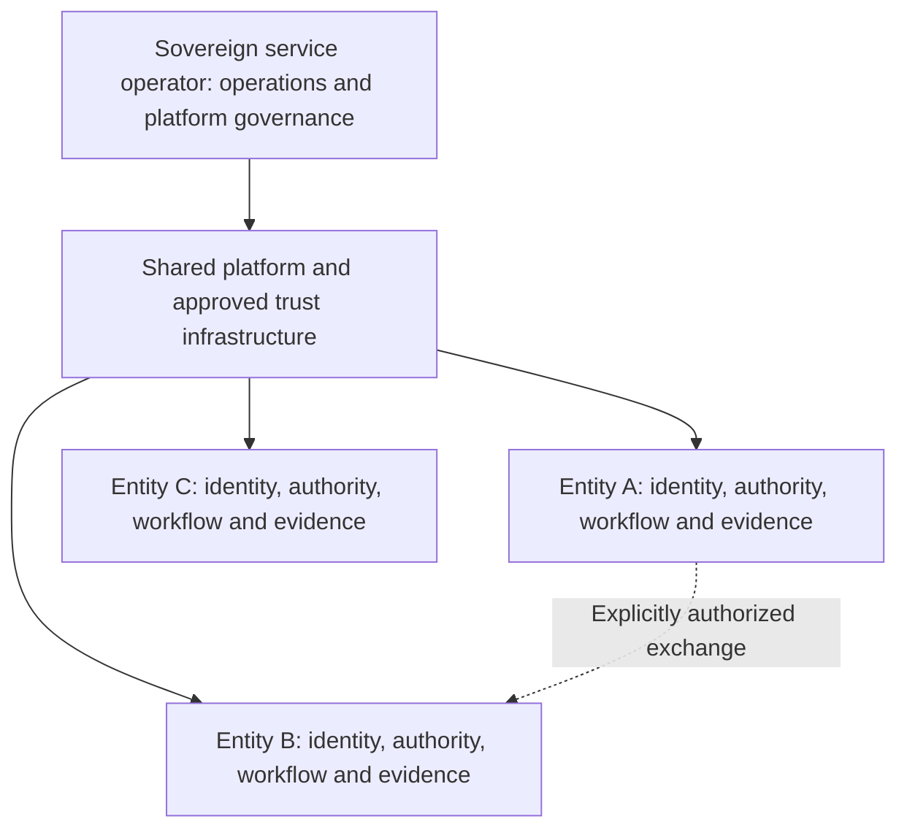

# Circularo Competitive Positioning Master

**Research date:** 25 September 2026 (Australia/Brisbane)  
**Status:** Internal research draft; non-canonical; prepared for accountable-owner review.  
**Classification:** Internal. Not approved customer, partner or investor copy.  
**Proposed accountable owner:** `role:cso`; product and architecture review required, with Product Marketing and Partnerships reviewers to be named.  
**Next competitive review:** 25 November 2026; refresh fast-moving agentic claims before any reuse.  
**Purpose:** A decision reference for strategy, product, competitive selling and subsequent approved messaging. This document tests the narrative; it does not certify the product or approve commercial terms.

## Contents

1. [Executive summary](#1-executive-summary)
2. [Circularo competitive positioning](#2-circularo-competitive-positioning)
3. [Market and competitor taxonomy](#3-market-and-competitor-taxonomy)
4. [Enterprise SaaS competitive landscape](#4-enterprise-saas-competitive-landscape)
5. [Sovereign and regulated competitive landscape](#5-sovereign-and-regulated-competitive-landscape)
6. [Sovereign multi-tenant shared services](#6-sovereign-multi-tenant-shared-services)
7. [Organizational digital identity](#7-organizational-digital-identity)
8. [GCC competitive advantage](#8-gcc-competitive-advantage)
9. [Trust Orchestration competitive landscape](#9-trust-orchestration-competitive-landscape)
10. [Trusted Records](#10-trusted-records)
11. [Agentic Trusted Execution landscape](#11-agentic-trusted-execution-landscape)
12. [Strategic capability matrix](#12-strategic-capability-matrix)
13. [Competitive moats](#13-competitive-moats)
14. [Competitive white space](#14-competitive-white-space)
15. [Where competitors are stronger](#15-where-competitors-are-stronger)
16. [Where Circularo should compete and not compete](#16-where-circularo-should-compete-and-not-compete)
17. [Recommended positioning](#17-recommended-positioning)
18. [Competitor battlecards](#18-competitor-battlecards)
19. [Strategic recommendations and sixteen answers](#19-strategic-recommendations-and-sixteen-answers)
20. [Evidence and sources](#20-evidence-and-sources)
21. [Open questions and verification required](#21-open-questions-and-verification-required)

## 1. Executive summary

**Circularo has a credible, evidence-backed position in sovereign document workflows and government shared services. The research does not establish an exclusive architecture, a unique organizational-identity proposition, or an uncontested Trust Orchestration category.** Its strongest present opportunity is a specific combination of organizational control, local identity integration and usable document processes, reinforced by government service references. The strength of that combination must be demonstrated for each deployment.

Digital Dubai's own catalogue describes Digital Sign as a Circularo-powered service hosted on Digital Dubai infrastructure for government organizations. This is stronger evidence than a supplier logo list. TDRA independently describes GovSign as a federal service hosted on FedNet; Circularo identifies its technology contribution separately. These sources support a real government-service position, but do not disclose all tenant controls or prove every scale claim. [C06][C07][C08][C18]

The main counterevidence is substantial:

- **SigningHub/Ascertia is a direct architectural and service-provider competitor.** Its current offer includes private/on-premise deployment and TSP/MSP delivery. Its documentation separates platform and enterprise configuration. A supplier account identifies Saudi Telecom as using SigningHub plus ADSS. [S01][S03][S04][S06]
- **eMudhra is a serious combined signing, identity and PKI competitor.** emSigner documents custom domains, white-label experiences, multi-tenant configurations, customer SMTP and UAE PASS. Evidence concerning IDBroker, SecurePass or emCA must not be silently attributed to emSigner. [E02][E03][E04][E06][E07][E08]
- **Namirial is an additional relevant challenger.** eSignAnyWhere documents organization-level tenancy and SaaS, private SaaS and on-premise delivery. It belongs in the shared-service shortlist, subject to deployment-level proof. [N01][N02]
- **Mainstream SaaS is much broader than signing.** Docusign has workflow, agreement management and AI; Adobe has document infrastructure, configurable signing processes and identity/trust integrations; PandaDoc has document creation, approvals and an expanding contract-management offer. [D01][D02][A01][A04][P01][P03][P04]

### Thesis verdicts

| Hypothesis | Verdict | Strategic implication |
| --- | --- | --- |
| The combination matters more than an individual feature. | **Supported as a positioning hypothesis**, not proven competitive superiority. | Sell the complete operating requirement; measure implementation burden and outcome quality. |
| Few vendors span SaaS, sovereign deployment and shared services. | **A narrower competitive set is supported; a numerical rarity claim is not.** SigningHub and Namirial already span much of this intersection; emSigner merits direct testing. | Replace “only platform” with a buyer-specific explanation of why Circularo fits. |
| Circularo has deep organizational identity. | **Documented breadth; uniqueness rejected.** | Emphasize the coherent package and deployment fit, not ownership of branding, domains, SMTP or certificates as inventions. |
| Circularo has a GCC advantage. | **Credible and strongest in evidenced UAE government use; uneven across GCC.** | Separate UAE proof, KSA integration/distribution and the still-unproven wider-GCC extrapolation. |
| Trusted Records can create defensibility. | **Potential.** Existing evidence and archives are foundations, not a demonstrated proprietary data advantage. | Build reusable authority-to-outcome evidence and reliable export/retrieval. |
| Agentic Trusted Execution is open territory. | **Broad white-space claim rejected.** Identity, workflow and platform vendors already occupy adjacent controls. | Pursue a narrow business-action role and integrate with established identity, policy and agent systems. |

**Most defensible current positioning, proposed:** Circularo connects document preparation, organizational approvals, signing and retained evidence for enterprises and government-service operators that need local integration and control over their operating environment. Its strategic direction is **Trust Orchestration**, with **Trusted Execution** as the intended outcome. The agentic extension remains future-facing. [I01][I02][I03]

## 2. Circularo competitive positioning

### 2.1 Preserve the strategic taxonomy

| Term | Meaning and competitive boundary |
| --- | --- |
| **Trust Orchestration Platform** | What Circularo is strategically becoming: coordination of content, actors, authority, decisions, trust services and evidence. This does not establish that all these controls are released or supplied natively. |
| **Trusted Execution** | Intended governed business outcome under applicable requirements, supported by evidence. It is not a hardware trusted execution environment or an unconditional legal guarantee. |
| **Trusted Records** | Retained content, provenance, authority, decisions, trust events and process evidence. Completeness and preservation strength depend on actual capture and retention. |
| **Trust as a Service / Shared Services** | An operating model in which an operator makes trust capabilities available to multiple organizations. Sovereignty and tenancy are separate architecture decisions. |
| **Agentic Trusted Execution** | Future extension to actions prepared, initiated or performed by agents under delegated authority. Permission to prepare is different from permission to approve or execute. |

The active narrative calls the act being governed a **trusted action**; the name expresses the required standard, not prior validation. This research also uses the task's phrase “consequential digital actions” to describe business impact. It is not a replacement taxonomy or a claim that an action already satisfies its requirements. [I01]

The four supplied narratives are the primary strategic source. Their own draft status and boundaries remain authoritative for interpreting the intended story. They are not product acceptance evidence. [I01][I02][I03][I04]

### 2.2 Current capability, deployment proof and direction

| Evidence layer | What is supported | What remains outside the evidence |
| --- | --- | --- |
| **Current approved repository scope** | `edition-model:plan-edition-deployment` records SaaS/self-hosted options and logically isolated multi-organization hosting. `commercial-rule:api-access` governs API access. Both are revision 1, approved, internal, reviewed 28 August 2026 and due 26 November 2026. [I05][I06] | These commercial records do not certify isolation implementation, air-gap operation, all API functions or feature parity in every topology. Commercial packaging must be resolved by stable ID rather than copied here. |
| **Current product documentation** | Brand controls, own-domain SMTP, national-identity integrations, tenancy configurations and document AI assistance are documented. [C01][C02][C03][C04][C11][C16] | Documentation establishes a described capability, not an independent penetration test, usability benchmark or deployment acceptance. |
| **External deployment evidence** | Digital Dubai operator attribution and TDRA's service description support government use. [C06][C07] | Exact active entities, current transaction volumes, operational SLAs and every tenant control remain unverified. |
| **Supplier-reported customer evidence** | The EMAAR case describes branded communications and integration with an existing BPM environment. [C10] | It does not establish general price superiority or a reproducible advantage over all competitors. |
| **Marketed capabilities requiring product confirmation** | Shared-service pages describe collaboration, vault/retention and broader trust-service capabilities. [C15][C18] | Confirm product version, native versus integrated delivery and availability in each deployment. Broad public certification and legal language is not adopted here. |
| **Roadmap and strategy** | The internal review identifies planned eDoc and unconfirmed Unified Trust API scope; the agentic narrative defines future requirements. [I03][I04] | No release commitment, complete agent policy engine, universal execution gateway or proven institutional-memory moat is established. |

The repository's `company:circularo` remains **reviewed**, not approved as a general corporate proof record. The sovereign deck remains **draft**. The open material `conflict:add-on-workspace-scope` is overdue for review; this document does not decide it or promise workspace-scoped entitlements. Public use of “workspace” is not a commercial enforcement definition. [I04][I07]

### 2.3 The test that matters

Circularo should win where a buyer values the **combined implementation** more than any isolated product category. Test an actual process: an agency prepares a document; its authorized role approves the exact version; the required identity/trust service participates; the result is delivered; evidence can later be retrieved by the appropriate entity. Compare effort, exceptions, control gaps and operator costs across vendors. A feature inventory alone cannot answer this question.

## 3. Market and competitor taxonomy

| Layer | Buyer and buying decision | Primary set | Why this is a separate contest |
| --- | --- | --- | --- |
| **1. Enterprise SaaS / agreement platforms** | Business or IT team procuring document/signature workflows. | Docusign, Adobe Acrobat Sign, PandaDoc, SignNow, Dropbox Sign. Add Zoho Sign where its suite or identity controls matter. | User adoption, workflow fit, ecosystem and commercial friction dominate. [D01][A06][P04][L01][L02][Z01] |
| **2. Sovereign / regulated platforms** | Architecture, security and business owners selecting a controlled deployment. | emSigner/eMudhra; SigningHub/Ascertia; add OneSpan Sign and Namirial for relevant tenders. | Key custody, trust infrastructure, topology and operational responsibility become selection gates. [E01][S01][O01][N02] |
| **3. Sovereign multi-organization shared services** | Government, telco or service operator provisioning independent customers/entities. | Circularo; SigningHub; emSigner; Namirial. OneSpan remains a conditional candidate pending independent-entity proof. | Commercial SaaS tenancy or departments in one account do not prove an operator-controlled shared service. |
| **4. Trust Orchestration / Trusted Execution** | Enterprise or government deciding where cross-system authority, execution and evidence should reside. | Agreement, PKI, IAM, BPM, records, government, agent and enterprise-platform categories. | Systems integrators and customer-built combinations can be the most consequential alternatives. See sections 9–11. |

**Additional-vendor decisions:** OneSpan is promoted to the regulated shortlist because current product documentation supports on-premise delivery. Namirial is promoted to the shared-service architecture comparison. Zoho is added as a concrete counterexample to organizational-identity uniqueness. Entrust, Swisscom Trust Services and InfoCert are assessed as trust infrastructure or adjacent workflow suppliers; the evidence here does not justify treating each as an equivalent national shared-service platform. [O01][O02][N01][Z01][Z02][T01][T02][T03]

## 4. Enterprise SaaS competitive landscape

### 4.1 Market-specific matrix

**Ratings are analyst assessments of documented scope, not measured product quality.** “Strong” means substantial relevant capability is documented; “Moderate” means meaningful but narrower or integrated scope; “Limited” describes a documented boundary; “Not evidenced” means this research did not establish the capability. Capabilities from a vendor's separate products are labelled rather than pooled into a fictional base subscription.

| Buying dimension | Circularo | Docusign | Adobe Acrobat Sign | PandaDoc | SignNow | Dropbox Sign |
| --- | --- | --- | --- | --- | --- | --- |
| Signing and execution | Strong document-process foundation; exact assurance profile needs confirmation. [C13] | Strong; broad signing and trust options. [D06] | Strong; signatures, identity and seals. [A04][A05] | Strong business signing; qualification depends on provider/offer. [P03] | Strong core eSignature. [L03] | Strong focused signature workflow. [L06] |
| Preparation and document generation | Moderate; document tools plus collaboration integrations. [C13][C15] | Strong across broader portfolio; generation and CLM are separately scoped. [D06] | Strong PDF ecosystem; Sign workflow is not all Acrobat functionality. [A06] | Strong sales-document generation and templates. [P04] | Moderate; templates/forms and API. [L01][L03] | Moderate templated/embedded preparation; rich proposal authoring not established here. [L06][L07] |
| Approvals and workflow | Strong documented routing proposition; general BPM equivalence unproven. [C13] | Strong Maestro and agreement automation. [D01] | Strong configurable sending processes. [A01] | Strong template-based and conditional approvals. [P01] | Moderate signing flows and team controls. [L03][L05] | Moderate signing flows with conditional fields/reminders; full business approval engine not established. [L06] |
| Collaboration | Integrated co-authoring/review; configuration matters. [C15] | CLM/agreement collaboration within portfolio. [D06] | PDF and Sign integration context; assess co-authoring separately. [A06] | Document collaboration and contract workflows. [P08] | Teams and reusable shared templates. [L05] | Team signing; independent content-collaboration scope unverified. [L06] |
| Archive / records / CLM | Document archive foundation; full CLM and records depth needs validation. [C12] | Strong agreement management, repository and CLM breadth. [D01][D06] | Retention/export and surrounding integrations; full CLM not established for Sign alone. [A06] | Contract management expanding; extraction rollout is conditional. [P06][P08] | Signed-file export; full records management not established. [L01] | Completed PDF and audit trail; full DMS not established. [L04] |
| Evidence and APIs | Document/API proposition; completeness must be tested. [C13][I06] | Strong portfolio/API breadth. [D09] | Strong documented embedding, audit retrieval and archival interfaces. [A06] | Document-generation API and audit history. [P03][P09] | API returns signed documents and audit trail. [L01] | Embedded API and tamper-evident transaction history. [L07][L04] |
| Integrations | API-led and specific collaboration/BPM examples; packaged-connector breadth needs inventory. [C10][C15] | Broad documented ecosystem; confirm required product/connector. [D08] | Documented integration and embedding interfaces. [A06] | CRM-connected generation and developer interfaces. [P04][P09] | API integration path; exact native connectors to qualify. [L01] | Packaged cloud-storage/CRM integrations and embedded API. [L06][L07] |
| Enterprise administration | Tenancy and administration options; see topology limits. [C16] | Central management across accounts/domains. [D03] | Account/group and partner administration. [A08][A07] | Workspace/approval configuration. [P01][P02] | Team roles and permissions. [L05] | Account-level and app-level branding boundaries. [L02] |
| Identity and trust services | UAE PASS and Nafath use cases documented. [C03][C04] | Identity and certificate-based signatures in portfolio. [D06] | Identity gateway and organizational seals. [A04][A05] | Provider-backed higher assurance options. [P03] | Authentication options; exact national-ID scope unverified. [L03] | QES through trust-provider integration and authentication controls; qualify exact offer. [L06] |
| AI | Document summary assistance documented; agent authority remains future. [C11][I03] | Iris and agents marketed; availability is feature-specific. [D02][D07] | Assess Acrobat AI separately; no equivalent Sign agent-control claim established here. | Assistant documentation identifies closed beta; repository extraction rolling out; MCP documented. [P05][P06][P07] | Not evidenced for a comparable governed-agent layer. | Not evidenced for a comparable governed-agent layer. |
| Identity of the organization | Broad configurable package; see section 7. [C01] | Branded sender domains are documented. [D03] | Branding, vendor-domain hostname and custom emails. [A02][A03] | Branded delivery domain; document links retain PandaDoc domain under that feature. [P02] | Branding exists; own SMTP/full application identity not established. [L03] | Branded emails/signing; app/account limits apply. [L02] |

### 4.2 Where Circularo wins, is comparable, loses or depends on requirements

| Outcome | Decision assessment |
| --- | --- |
| **Potential win** | The buyer needs a locally integrated document process, its own application/communication identity and a path to a customer-operated environment. Circularo has relevant evidence for this combination; a comparative proof of concept must establish the win. |
| **Comparable** | Standard signing, templates, approvals, audit history, APIs, branding and many integrations are shared competitive capabilities. They earn inclusion in a shortlist rather than justify category leadership. |
| **Likely loss / disadvantage** | Docusign is better positioned when broad agreement/CLM capabilities and its ecosystem are decisive. Adobe is better positioned when PDF tooling and existing Acrobat adoption dominate. PandaDoc is a strong alternative when rich proposals, generation and revenue-team workflows dominate. These are strategic fit assessments, not head-to-head test results. [D01][D06][A06][P04] |
| **Requirement-dependent** | Arabic sender/admin experience, customer SMTP, customer domain, sovereign topology, native connectors and operator control can change the answer. So can security review, service quality, rollout effort and the actual quote. |
| **Unknown until measured** | Ease of use, total cost, signing completion rate, deployment speed, administrator effort and support quality. No controlled comparative trial or current like-for-like commercial bids were available. |

Do not transfer all airSlate capabilities to SignNow, all Adobe capabilities to Acrobat Sign, or all Docusign products into an eSignature-only comparison. Equally, do not price Circularo's full combined proposition against a competitor's entry plan and call that a capability victory.

## 5. Sovereign and regulated competitive landscape

### 5.1 eMudhra / emSigner: serious direct competition

emSigner is documented as a cloud or bespoke on-premise document/signature workflow solution, with APIs, audit history and PKI options. Its product-specific SMTP and white-label documentation materially challenges Circularo's identity story. The UAE PASS integration is supported by both product guidance and a supplier-reported Nawah implementation. [E01][E02][E03][E04][E05]

**Separate the portfolio carefully:** historical emAS materials describe authentication/IAM. Current SecurePass materials cover IAM/MFA and broader identity governance, including multi-tenant deployment. IDBroker describes national-identity and CSP operating models. An emCA defense reference describes an air-gap-capable PKI. These are relevant competitive building blocks, but none by itself proves an air-gapped emSigner Enterprise shared service. “emSigner Enterprise” must be qualified by actual version, licensed modules, connectors and operator model. [E06][E07][E08][E09]

The strongest emSigner challenge is that an experienced trust supplier can combine workflow, identity and certificate infrastructure within the same procurement. Circularo should counter with a demonstrated process and operating model, not an assumption that eMudhra is only a certificate issuer. The assembled-stack cost, deployment burden, feature consistency and cross-product evidence chain remain fair questions for both vendors.

### 5.2 Ascertia / SigningHub: closest documented service-provider challenge

SigningHub's offer explicitly addresses government, enterprise and TSP/MSP buyers. Its documented enterprise policies and platform branding should be evaluated as genuine overlapping capability. ADSS supplies cryptographic infrastructure; it is a distinct product boundary. The current datasheet supports advanced/qualified signing, private deployment and signed workflow evidence. [S01][S02][S03][S04]

The historical architecture explicitly describes a commercial managed service serving paying customers from any organization. This is important counterevidence, but its 2017 implementation details must not be treated as a current configuration guide. The 2026 admin guide and current enterprise documentation corroborate continued configuration layers. [S05][S07][S04]

Supplier-reported national PKI work and the Saudi Telecom signing stack support a real delivery footprint. They do not disclose enough to certify one-to-one parity with Digital Dubai's tenancy design. [S06]

### 5.3 Regulated-market matrix

| Dimension | Circularo | emSigner / eMudhra | SigningHub / Ascertia | OneSpan Sign | Namirial eSignAnyWhere |
| --- | --- | --- | --- | --- | --- |
| Controlled hosting | Approved deployment model; exact topology to establish. [I05] | On-premise documented for emSigner. [E01] | On-premise/private/hybrid documented. [S02] | Current on-premise documentation and public/private options. [O01][O02] | On-premise/private SaaS documented. [N01][N02] |
| Air-gapped operation | **Not evidenced** for a complete supported profile. | Portfolio evidence in IDBroker/emCA; complete emSigner profile **not evidenced**. [E08][E09] | Offline full-stack operating profile **not evidenced** here. | **Not evidenced** here. | **Not evidenced** here. |
| Trust infrastructure | Integration-led; provider and key-custody scope to confirm. [C14] | Strong portfolio capability; do not conflate components. [E06][E09] | Strong ADSS-based capability. [S01][S02] | Regulated signing focus; detailed PKI architecture needs diligence. [O02] | Workflow and trust-service integration; topology/provider dependent. [N01] |
| National identity / GCC | Relevant integrations and operator proof. [C03][C04][C06] | UAE PASS and UAE deployment evidence. [E04][E05] | Saudi service-provider reference; named connectors require confirmation. [S06] | Equivalent GCC reference not established here. | Equivalent GCC reference not established here. |
| Workflow / evidence | Connected document-process offer. [C13] | Document workflow and audit capability. [E01] | Approval workflow and signed evidence. [S02] | Preparation through signing documented. [O01] | Workflow and audit trail documented. [N01] |
| Independent-entity service | Documented configurations and operator service; see section 6. | Candidate with specific multi-tenant product evidence. | Strong candidate with service-provider evidence. | Company-wide shared service documented; national independent-entity model unresolved. [O02] | Strong architecture candidate; named sovereign operation unresolved. |

### 5.4 Other relevant suppliers and substitutes

| Supplier / platform | Evidence-backed role | Inclusion decision |
| --- | --- | --- |
| **Entrust** | On-premise certificate-signing engines and remote signing infrastructure. [T01] | Primary competitor for trust-infrastructure components; partner or component within a competing full solution. Equivalent multi-agency document platform not established here. |
| **Swisscom Trust Services** | Qualified/advanced signing and integration interfaces; a separate Swisscom Sign workflow API is also documented. [T02][T04] | Trust-service partner/adjacent competitor. Do not infer complete national workflow tenancy from trust-service APIs. |
| **InfoCert / Tinexta** | GoSign identity assertion and enterprise signing documentation. [T03][T05] | Relevant in high-assurance European signing and partner stacks. Customer-controlled national shared-service architecture requires further evidence. |
| **stc / Sayen** | Operator documents document signing, workflows and KSA hosting; Ascertia separately reports supplying its stack. [G01][S06] | Direct KSA buyer alternative and concrete challenge to telco-platform uniqueness. Do not assume every current Sayen component is unchanged. |
| **SDAIA Ebram / IBRAM** | Government sources document a signature service for government users/entities. [G02][G03] | Government-owned substitute or integration target. Vendor identity, tenant architecture and procurement accessibility are not established. |

## 6. Sovereign multi-tenant shared services

### 6.1 Qualification standard

The relevant question is whether **one operator-controlled deployment can serve many legally or organizationally independent entities, each retaining appropriate control of its decisions and information**. The number of SaaS accounts, departments or signers is insufficient evidence.

Use four separate evidence tests:

1. **Product:** supported entity model, scoped identity, administrative roles and interfaces.
2. **Architecture:** isolation, key custody, networking, recovery, upgrades and regional dependencies.
3. **Operation:** real service operator, entity onboarding, service ownership, capacity and incident handling.
4. **Authority:** entity-specific mandates, trust services, policy responsibility and evidence access.

A supplier can pass product and architecture tests while lacking a proven national operation. A named national service can pass the operation test while its detailed isolation design remains undisclosed. These are different uncertainties.

This is a target operating model, not an assertion that all products or Circularo configurations implement every box identically.

### 6.2 Circularo's own architecture needs precise presentation

The product guide distinguishes **A: teams under one organization**, **B: separate organizations in a shared database**, and **C: independent tenants/databases on common hardware**. A has constraints when a user belongs to multiple differently configured entities. B separates organizations but requires different user/email identities for cross-organization membership; organization-specific recovery involves manual work. C permits separate accounts with the same email, but technical setup, configuration transfer and greater resource use are explicit tradeoffs. The guide allows mixed models. **Do not promise the autonomy of C, simplicity of A and economics of B as one universal configuration.** Confirm the guide against the proposed release. [C16]

The shorter multi-organization page explicitly describes subordinate units using Teams, rather than separate tenants. Consequently “multi-organization” in a slide cannot serve as a precise isolation claim. [C17]

### 6.3 Real reference evidence

| Reference | What the research establishes | What it does not establish | Evidence treatment |
| --- | --- | --- | --- |
| **Digital Dubai / Digital Sign** | Operator catalogue names Circularo, government audience, Digital Dubai hosting and national-identity integration. [C06] | Full tenant topology, active entity count, every control and audited production metrics. | **Operator-confirmed service and attribution.** Strongest clean reference in this research. |
| **TDRA / GovSign** | TDRA launch and FedNet catalogue describe a federal service and operator hosting. Circularo's Q&A identifies its contribution. [C07][C08][C18] | Launch audience or eligibility does not prove active adoption by every federal entity. | **Operator-confirmed service; supplier-attributed technology relationship.** Seek joint approved reference. |
| **Sharjah Sign** | Circularo lists it; a matching WAM report about Sharjah's digital department was located. [C05][C19] | WAM full article body was not retrievable. Circularo's capacity wording is not an active deployment count. | **Supplier-reported; independent report located but insufficiently inspected.** |
| **e& DigiSign** | Present in supplied internal reference material. [I04] | No sufficiently inspected operator product/architecture source obtained. A third-party repost was not used as proof. | **Reported internally; verification outstanding.** |
| **TCC / Mohkam** | Circularo's shared-service page links the product as “Mokham”; TCC's own announcement uses Mohkam and describes its signing offer. [C05][G04] | TCC announcement alone does not prove Circularo's underlying tenancy architecture or active downstream organizations. | **Operator-announced product; supplier-reported Circularo relationship.** Resolve spelling in approved reference register. |
| **Ascertia / Saudi Telecom** | Supplier identifies SigningHub and ADSS; operator independently markets Sayen. [S06][G01] | Exact current service-to-stack mapping and independent customer isolation. | **Credible competing service reference, with architecture gaps.** |
| **eMudhra / Nawah** | Named supplier case describes local signing infrastructure, identity and system integration. [E05] | This is a regulated enterprise reference, not proof of a multi-agency national service. | **Supplier-reported deployment.** |
| **Namirial** | Product tenancy is explicit. [N01] | No named sovereign multi-agency reference was established in this research. | **Architecture evidence; deployment proof open.** |

Do not merge **Digital Dubai Digital Sign**, **e& DigiSign**, or unrelated vendors named DigiSign/DigitalSign. Names are not proof of a common service.

### 6.4 Detailed shared-service comparison

Only candidates with relevant product or service-provider evidence are included. **Documented** means product evidence; **reported** means supplier/reference assertion; **partial** means a relevant component exists but the full requirement is not established; **NE** means not evidenced in the reviewed sources. These are not certification grades.

| Requirement | Circularo | SigningHub / Ascertia | emSigner / eMudhra | Namirial eSignAnyWhere |
| --- | --- | --- | --- | --- |
| Tenant/data isolation | Documented; choose A/B/C deliberately. [C16] | Enterprise/service model documented; security isolation implementation needs evidence. [S04][S05] | Multi-tenant branding/configuration documented; isolation details incomplete. [E03] | Organization=tenant documented; implementation assurance open. [N01] |
| Tenant administration | Documented options; role boundaries require demo. [C16] | Enterprise admin layer documented. [S04] | Super-admin settings documented; full tenant delegation partial. [E02] | Organization admin roles documented. [N01] |
| Delegated administration | Partial; require separation of operator and entity powers. [C15] | Partial; enterprise/private-profile controls. [S04] | Partial; SecurePass capability is not emSigner proof. [E07] | Partial; administrator versus operator authority to test. [N01] |
| Tenant branding | Documented per-organization proposition. [C15] | Platform defaults and enterprise overrides. [S03] | Per-brand/business-unit configurations. [E03] | NE at equivalent full-stack scope. |
| Tenant-owned domains | Custom domain documented; per-topology mapping to confirm. [C09] | Enterprise URL documented; arbitrary customer-domain scope unconfirmed. [S04] | Own-domain signing links documented; per-tenant mapping to test. [E03] | NE at required scope. |
| Tenant email identity / SMTP | Own infrastructure documented; per-topology setup to test. [C02] | SMTP and service-plan connectors evidenced; exact tenant mapping to validate. [S04][S05] | Own SMTP documented; independent tenant binding to validate. [E02] | NE at required scope. |
| Tenant certificates | Organization certificates documented; key segregation to verify. [C14] | Organizational PKI support; assignment/custody to verify. [S02] | PKI available; per-tenant assignment/custody unconfirmed. [E01] | Trust-service signing exists; tenant key isolation unconfirmed. [N01] |
| Tenant workflows | Entity/workflow separation marketed. [C15] | Enterprise process settings documented. [S04] | Workflow plus multi-brand configurations; independence needs test. [E01][E03] | Organization workflow scope documented. [N01] |
| Tenant IdPs | Organization identity configuration; simultaneous different IdPs to test. [C03] | Enterprise private authentication profiles documented. [S04] | Product identity integration; per-tenant different IdPs unconfirmed. [E04] | NE for separate IdPs in one sovereign deployment. |
| Tenant trust services | Supported integrations; independent provider/policy assignment unconfirmed. [C14] | Multiple PKI options; exact enterprise routing needs design. [S02] | Portfolio breadth; emSigner per-tenant routing unconfirmed. [E01] | Remote trust-service support; per-tenant selection unconfirmed. [N01] |
| Central platform administration | Documented/marketed. [C15] | Distinct platform admin documented. [S07] | Multi-tenant implementation exists; operator lifecycle scope partial. [E03] | Architecture candidate; full operator lifecycle needs proof. [N01] |
| Central upgrades | Shared deployment makes central operation plausible; uninterrupted tenant upgrades NE. | Same distinction; current rollout/rollback proof needed. | Same distinction; product/version-specific proof needed. | Same distinction; product/version-specific proof needed. |
| Common infrastructure | Documented. [I05] | Commercial managed service model. [S05] | Single implementation with multiple configurations. [E03] | Multi-tenant design and deployment options. [N01][N02] |
| Downstream billing / chargeback | NE as a complete native operator billing capability. | Historical optional billing documented; current supported scope to confirm. [S05] | IDBroker claims downstream billing; emSigner equivalence NE. [E08] | NE as complete native operator billing. |
| API isolation / credentials | API exists; adversarial tenant-isolation test required. [I06] | API scope exists; adversarial isolation test required. [S02] | API exists; adversarial isolation test required. [E10] | API exists; adversarial isolation test required. [N01] |
| Evidence isolation / export | Test read, export, retention and cross-entity shares. | Same acceptance requirement; signed reports alone are insufficient. [S02] | Same acceptance requirement; audit history alone is insufficient. [E01] | Same acceptance requirement; audit history alone is insufficient. [N01] |
| Data residency | Operator-hosted reference; dependencies must be mapped. [C06] | Private hosting; identity/trust/support dependencies to map. [S01] | In-region reference; all dependencies to map. [E05] | Private/on-premise options; dependencies to map. [N02] |
| Independent policy / authority | Workflow authority proposition; legal mandates not automatically established. [I02] | Enterprise policies; legal mandates not automatically established. [S04] | Workflow/IAM combination; legal mandates need separate binding. [E06] | Permissions and routing; legal mandates need separate binding. [N01] |
| Dozens/hundreds of independent entities in one sovereign service? | **Credible candidate with operator proof; exact capacity and configuration unverified.** | **Credible direct competitor; service-provider evidence exists, exact parity unverified.** | **Credible challenger; full operator architecture and reference must be established.** | **Credible architecture challenger; sovereign operating reference must be established.** |

### 6.5 Interpretation and falsification

Circularo's shared-service position is **strategically important and more specialized than a standard eSignature subscription**. It is not demonstrated to be technically unique. The differentiation could reside in implementation patterns, regional relationships, operator experience and easier adoption of independent entities. Those are hypotheses requiring operational metrics.

The thesis weakens if competitors can deliver the same controls, local services and onboarding economics with credible references. It strengthens if Circularo repeatedly onboards independent agencies faster, with fewer bespoke changes, better evidence portability and lower measured operator burden. Absence of published competitor evidence is not proof that this cannot happen.

### 6.6 Reference architecture acceptance exercise

Run the same test for Circularo and finalists: create three unrelated entities, including two using the same human administrator under different mandates. Give them different domains, mail servers, IdPs, certificates, retention rules and approval authorities. Establish central operator access separately.

Test cross-tenant API/object access, search, audit export, webhook routing, backup restoration, tenant suspension and deletion. Run an explicitly permitted inter-agency exchange and a forbidden one. Revoke a role and a certificate mid-process. Upgrade and roll back; measure impact on unaffected entities. Export one entity's complete evidence and recover it into an isolated environment. Add billing/usage reconciliation and a load test reflecting expected concurrency rather than marketing transaction totals.

**Sovereign acceptance also needs dependency failure tests:** internet unavailable, external identity provider down, OCSP/timestamp service unavailable, support access revoked and local HSM unavailable. Require honest failure states. An on-premise installer is not proof of disconnected operation.

## 7. Organizational digital identity

### 7.1 What is actually being compared

Distinguish **presentation identity** (logo/name), **address identity** (domain), **communication identity** (sender domain and mail infrastructure), **cryptographic organizational identity** (certificate/seal), and **institutional authority** (permission to perform a particular action). One does not prove another. A logo is not delegated authority; a company seal does not establish that the correct internal approval occurred.

### 7.2 Identity-depth matrix

| Surface | Circularo | Docusign | Adobe Acrobat Sign | PandaDoc | emSigner | SigningHub |
| --- | --- | --- | --- | --- | --- | --- |
| Logo / application styling | Documented. [C01][C20] | Customizable brand experience in product scope. [D08] | Account/group logo. [A08] | Branding tools. [P10] | White-label UI. [E03] | Platform and enterprise controls. [S03] |
| Application name | Named add-on documented at catalogue level; exact surfaces to confirm. [C01] | Full app renaming NE. | Full app renaming NE. | Full app renaming NE. | Complete product-name replacement NE. | Complete product-name replacement NE. |
| Customer-owned web domain | Documented. [C09] | Full vendor-app own-domain operation NE here. | Documented hostname remains within Adobe domain. [A02] | Delivery-email feature does not change document links. [P02] | Own signing domain documented. [E03] | Enterprise URL exists; arbitrary DNS-domain parity needs verification. [S04] |
| Customer email domain | Documented. [C02] | Documented. [D03] | Exact own-domain sender configuration NE in reviewed evidence. | Documented branded subdomain. [P02] | Documented through own SMTP. [E02] | SMTP configurations exist; tenant binding requires validation. [S04][S05] |
| Customer email server | Documented. [C02] | Customer-operated SMTP NE. | Customer-operated SMTP NE. | Customer-operated SMTP NE. | Documented. [E02] | Infrastructure support evidenced; current configuration validation needed. [S05] |
| Notification text / appearance | Styling and notification-content controls are distinct. [C20][C02] | Precise editing/mandatory branding boundary to confirm. | Enterprise custom HTML templates documented. [A03] | Branded email configuration; exact surfaces vary. [P02][P10] | Custom templates documented. [E03] | Interface/email branding and configuration documented. [S03] |
| Organization certificate / seal | Documented; issuance and trust scope matter. [C14] | Digital-signature portfolio; exact organizational sealing flow to verify. [D06] | Explicit legal-entity electronic seals. [A05] | Relevant QES provider support; equivalent org sealing NE here. [P03] | PKI and certificate options; exact org sealing profile to verify. [E01] | Organization PKI and signing/sealing scope. [S02] |
| White-label / powered-by model | Marketed; baseline styling is not full white-label. [C05][C20] | Embedded experience ≠ proof of complete removal. | Partner embedding and customer management documented; full invisibility NE. [A07] | Email white-label ≠ entire application white-label. [P02] | Explicit embedded white-label proposition. [E03] | Explicit TSP white-label proposition. [S01] |
| Vendor visibility after completion | Audit, certificate chain, support, mobile and legal pages need inspection. | Same inspection requirement. | Same inspection requirement. | Vendor domain documented in stated flow. [P02] | Same inspection requirement. | Same inspection requirement. |

**Conclusion:** Circularo can credibly emphasize the breadth of its organizational identity configuration. It should not claim uniqueness or assume it is deeper than every SaaS alternative. Zoho Sign explicitly documents customer-domain mapping and customer SMTP; its pricing page still labels SMTP early access/on request, so availability must remain qualified. This is an important SaaS counterexample even if Zoho is not the principal sovereign competitor. [Z01][Z02][Z03]

**Recommended theme:** “Keep your organization's identity visible throughout trusted digital interactions.” This is stronger and more precise than saying customers otherwise “surrender” their identity to a vendor. Validate the required surfaces in a real transaction, including invitation, login, approval, signing, reminders, completed PDF, evidence report, mobile interface and support links.

The integration value may be commercially meaningful even where every component is available elsewhere. Quantify how many contracts, configuration steps and operating responsibilities a customer needs to achieve the same result. That is a testable value proposition.

## 8. GCC competitive advantage

| Requirement / geography | Circularo evidence | Competitive counterweight | Conclusion |
| --- | --- | --- | --- |
| **UAE government service** | Digital Dubai attribution and TDRA service evidence. [C06][C07] | emSigner has UAE enterprise references and identity integration; SigningHub has regional delivery evidence. [E04][E05][S06] | Meaningful reference advantage in specific government-service conversations, not monopoly. |
| **UAE PASS** | Login, recipient verification and digital signing are separately documented. [C03] | emSigner documents UAE PASS use; API includes relevant options. [E04][E10] | Integration is valuable; uniqueness is false. Compare workflow coverage and operating restrictions. |
| **KSA / Nafath** | Login and recipient verification documented. This does not prove a Nafath-issued signing certificate. [C04] | stc/Sayen and SDAIA government services are local alternatives. Signit documents customer-configured Nafath verification and markets an Arabic-first signing experience. [G01][G02][G07][G08] | KSA must be assessed separately from UAE; integration does not establish national market leadership. Include Signit in local enterprise opportunities; sovereign shared-service equivalence is not established. |
| **Arabic and RTL** | Public product wording describes an Arabized interface; FedNet catalogue identifies Arabic support. [C21][C08] | Docusign lists Arabic for signing, while its sender-language list is different; emSigner materials list Arabic. [D05][E11] | Test sender, recipient, administrator, mobile, PDFs and mixed-direction documents separately. “Competitors do not support Arabic” is untenable. |
| **Local hosting / residency** | Documented operator-hosted service and controlled deployment options. [C06][I05] | Local/in-region emSigner reference, KSA Sayen, and private deployment suppliers. [E05][G01][S01][N02] | Residency is a selection requirement, not an exclusive capability or automatic compliance. |
| **Local regulatory adaptation** | Specific deployments and integrations provide useful context. | TDRA's older CSP page lists multiple international providers; it is not a current qualified-service determination. [G05][G06] | Verify current legal entity, service, assurance level and use case. Do not use generic “TDRA certified” superiority. |
| **Partners and support** | Internal e&/TCC references and documented TCC dependency for Nafath. [I04][C04] | stc service and eMudhra regional activity demonstrate alternatives. [G01][E12] | Measure delivery capacity, response times and partner economics. No comparable support benchmark was available. |
| **Rest of GCC** | No equivalent country-by-country evidence package established here. | Regional suppliers can expand; country rules and identity services differ. | Bahrain, Kuwait, Oman and Qatar remain separate validation tasks, not automatic extensions of UAE proof. |

**Defensibility assessment:** government delivery history and embedded organizational adoption can be harder to reproduce than language strings or a single connector. But references are a moat only if they generate repeatable access, delivery efficiency or renewals. Partner relationships may also create concentration risk and can be nonexclusive. The research supports a regional specialization strategy; it does not establish a permanent regional barrier.

## 9. Trust Orchestration competitive landscape

### Category map — not a direct product-equivalence matrix

| Category | Evidence-backed competitive center | Collision with Circularo's proposed role | Build / integrate / partner implication |
| --- | --- | --- | --- |
| **eSignature / agreement management** | Docusign agreement services, Adobe Sign and PandaDoc document workflows. [D01][A01][P04] | Can retain the agreement and coordinate approvals, reducing demand for another layer. | Differentiate where organizational authority and sovereign operation need more than the incumbent offer; integrate into established systems. |
| **PKI / trust services** | eMudhra portfolio, Ascertia ADSS, Entrust signing infrastructure, Swisscom and InfoCert services. [E09][S01][T01][T02][T03] | Can expand upward into business workflows or power a competing partner platform. | Partner for cryptographic primitives, qualified services and certificate lifecycle; avoid rebuilding an entire trust-service business without a separate business case. |
| **Identity / IAM** | Entra Agent ID, Auth0 authorization and eMudhra SecurePass. [F01][F02][E07] | Own the actor, access and delegation interfaces on which orchestration relies. | Consume authoritative identity and policy decisions. Preserve business mandate separately from a login or access token. |
| **Workflow / BPM** | Camunda documents BPMN-based agent orchestration and controllable tool execution. [F08][F09] | Process engines can own approval, action routing and operational evidence. | Integrate with enterprise process engines; own a narrow trust-relevant transaction contract where justified. |
| **CLM / DMS / records** | Agreement repositories and Microsoft Purview's retention/disposition controls. [D01][P06][F07] | Incumbents already own records and may extend their evidence model. | Link/export trusted execution evidence to the customer's records authority; do not insist every archive be replaced. |
| **Government / sovereign platforms** | Digital Dubai, FedNet and SDAIA services illustrate operator-owned infrastructure and services. [C06][C08][G02] | Government may build, buy, mandate a shared platform or use an integrator. | Supply an interoperable capability and clear responsibilities. “Build with existing infrastructure” is a serious competitor. |
| **AI governance / agent infrastructure** | ServiceNow, IBM, AWS policy infrastructure, identity-security suppliers and MCP standards. [F03][F04][F05][F06][F10] | Runtime policy, approvals, audit and agent control are already contested. | Specialize in business-action authority and verifiable outcomes; integrate discovery, secrets, access and model evaluation. |
| **Enterprise platforms** | Salesforce Agentforce and SAP Joule extend the systems where business actions originate. [F11][F12] | Native workflows can reduce both integration costs and the need for an independent intermediary. | Return authoritative completion evidence from the originating system. Offer a bounded connector, not an unsubstantiated replacement platform. |

**Strategic inference:** the intersection is a plausible position, but intersections are not intrinsically defensible. The product must resolve a difficult handoff better than incumbent combinations. A buyer who already has identity, BPM, trust services and records may rationally prefer integration work over another platform. Circularo needs evidence that it removes recurring work and control gaps, rather than merely renaming those existing components.

## 10. Trusted Records

### 10.1 Where the current foundation ends

Circularo documents archive/version capabilities, and its newer shared-service material markets stronger vault and retention features. These provide a relevant foundation, but the reviewed evidence does not establish the full proposed chain from organizational mandate to an externally completed action. Keep marketed retention/immutability claims subject to technical and product validation. [C12][C15][I01]

This is not empty competitive territory: SigningHub documents signed workflow evidence, Dropbox Sign describes a hashed transaction trail, and Purview documents records lifecycle controls. None should be dismissed as “just storage.” Conversely, none of those individual descriptions establishes the complete Circularo future concept either. [S02][L04][F07]

### 10.2 Proposed differentiating record contract

The strategic opportunity is a portable, permissioned **record of a consequential action** that can answer:

| Question | Required record element | Acceptance test |
| --- | --- | --- |
| What was proposed? | Exact content/version and intended action, including material parameters. | Changed amount, recipient or document invalidates the old approval. |
| Who acted and for whom? | Actor identity, represented organization and identity source. | The record distinguishes human, agent, service and organizational principal. |
| Under what authority? | Mandate, delegation chain, scope, expiry and policy version. | An expired or revoked mandate cannot authorize a new action. |
| Who approved? | Required approvals, reviewer identity, decision and approved version. | Approval cannot silently attach to a different payload. |
| What assurance applied? | Identity checks, certificates, signatures/seals, timestamps and validation results. | Evidence identifies the service/provider and failures, not just a green status. |
| What actually happened? | Execution receipt from the responsible system, outcome and exceptions. | A submitted request is distinguishable from completed, refused, failed or uncertain execution. |
| Can it be trusted later? | Integrity protection, retention history, access policy, provenance and export schema. | An independent reviewer can reconstruct the action without relying solely on a live vendor UI. |

These are **design requirements**, not a released Circularo specification. A record can establish provenance without proving the factual truth of its content. Cryptographic integrity does not prove that an upstream decision was correct or legally sufficient.

### 10.3 Moat test

Evidence becomes defensible through reusable schemas, reliable capture, integration coverage, accepted operating practice and retrieval under the correct permissions. It does not create an automatic cross-customer data network effect: sovereign tenant boundaries may prohibit pooling and reuse. Customer-controlled export should be a product strength. Retention value and switching effort can coexist with portability; making evidence artificially inaccessible is not a sound trust proposition.

## 11. Agentic Trusted Execution landscape

### 11.1 What already exists around the proposed execution boundary

| Control / market | Current evidence | Availability boundary | Implication for Circularo |
| --- | --- | --- | --- |
| **Agent identity and delegated access — Microsoft Entra Agent ID** | Documentation defines agent identities and token-based authorization, including user/tenant consent. [F01] | Documented product capability; exact feature rollout, licensing and sovereign-cloud availability were not tested. | Integrate identity lifecycle. Do not invent a competing universal agent directory. |
| **Agent authorization — Auth0** | Token Vault, tool/MCP authorization and human approval patterns are described. [F02] | Product documentation/offer; validate the specific component and deployment. | Delegation and human approval alone cannot be claimed as unique. |
| **Policy enforcement / action gateway — AWS AgentCore** | Cedar policies govern access to gateway tools. [F03] | Developer documentation; regional support and required runtime need checking. | Evaluate existing policy engines; differentiate the business evidence bound to their decisions. |
| **Enterprise AI control — ServiceNow** | AI Control Tower markets discovery, governance, security and observability; configuration documentation exists. [F04][F13] | Separate marketed coverage from enabled/version-specific controls. | Strong convergence threat where ServiceNow already owns workflows. |
| **AI governance and agent operations — IBM** | Governance documentation supports linking agents to use cases; Agentic Control Plane was announced for AWS/IBM Cloud in 2026. [F05][F14] | Distinguish documented governance from announcement-level capability; do not assume every assurance preview is available. | Partner or integrate for lifecycle/model governance; compete only at a defined action boundary. |
| **Non-human identity / privileged access — CyberArk** | Identity-first agent-security direction is publicly described. [F06] | Cited source is strategic vendor material, not a complete verified feature catalogue. | Integrate credentials and privileged-access controls; avoid developing a broad PAM replacement. |
| **Agent workflow / human-in-loop — Camunda** | Agent connector supports explicit tool-execution control; BPMN orchestration joins agents, rules and human tasks. [F08][F09] | Current version-specific documentation, not proof of Circularo integration. | A direct alternative for governing processes; target trust events and outcome evidence inside that process. |
| **MCP security / governance** | Official specification material prohibits unsafe token passthrough and describes authorization security. [F10] | Protocol/security requirements, not a turnkey product or legal authority model. | Use standard authorization, scoped credentials and correct audience checks. An MCP connector alone is not governed execution. |
| **Agreement agents — Docusign** | Iris pages now describe agents and MCP alongside agreement intelligence. [D02][D07] | Current offer/marketing; exact GA/beta access must be confirmed feature by feature. | This is already convergence within Circularo's core category. |
| **Document agents — PandaDoc** | Developer documentation describes an MCP interface; assistant/repository features have explicit availability qualifications. [P05][P06][P07] | Do not convert closed beta or gradual rollout into universal availability. | “AI can call our signing API” is not a differentiated future position. |
| **Business systems — Salesforce / SAP** | Agentforce trust documentation and Joule feature scope establish agent activity within enterprise platforms. [F11][F12] | Capability varies by product and configured permissions. | These systems may own final execution. Obtain evidence from them rather than assert completion upstream. |

### 11.2 What Circularo should build, integrate, partner for or avoid

| Decision | Recommended scope | Why |
| --- | --- | --- |
| **Build** | Business-action envelope linking entity, actor, mandate, exact payload, required approvals, assurance profile and result. | Connects the existing document/trust proposition to a specific control problem. |
| **Build** | State model for proposed, approved, executed, failed, declined and uncertain outcomes; revocation and replay protection. | Prevents a workflow request from masquerading as completion. |
| **Build** | Tenant-aware evidence assembly, retrieval/export and a reviewer view. | Makes the outcome inspectable across human, agent and system boundaries. |
| **Integrate** | IAM, agent identities, authorization engines, enterprise workflows, ERP/CRM/HR/procurement systems and archives. | Reuses authoritative systems and reduces adoption cost. |
| **Partner** | QTSPs, national identity services, HSM/key management, agent-security and model-governance suppliers. | Those disciplines require specialized assurance and continuing investment. |
| **Avoid building by default** | Foundation models, universal agent runtime, generalized SIEM/PAM/IAM, a broad BPM replacement, a full CA business or complete ERP. | Large adjacent markets do not imply Circularo has a defensible route to owning them. |

### 11.3 Minimum credible pilot

Start with one regulated renewal or official-issuance process. An agent prepares and submits; a named authority approves a fixed version; an existing system completes the action; Circularo assembles evidence. Deliberately test changed content, revoked delegation, duplicate execution, forged callback, unavailable trust provider and conflicting tenant policy. The agent must not bypass the gate through another credential or endpoint.

Success means a buyer can establish **what was allowed and what actually happened**, including failures. It does not mean all autonomous agents are governed, all legal requirements are satisfied, or a new broad category is already won. All Circularo capabilities in this pilot remain proposed until product confirms and acceptance tests pass. [I03]

## 12. Strategic capability matrix

Executive summary only; sections 4–7 contain the scope and evidence qualifications. **S = Strong; M = Moderate; L = Limited; NE = Not evidenced; FD = Future direction.** These are ordinal fit assessments, not scores. There is no overall points total. “Sovereign” means control requirements must be defined; it is never shorthand for blanket compliance. The table preserves the requested six-vendor core; Namirial and OneSpan are assessed in the market-specific matrices.

| Dimension | Circularo | Docusign | Adobe | PandaDoc | emSigner | SigningHub |
| --- | --- | --- | --- | --- | --- | --- |
| Enterprise SaaS completeness | M — scope to validate [C13] | S — broad portfolio [D06] | S — Sign + ecosystem [A06] | S — revenue/document focus [P03] | S — signing/workflow [E01] | S — regulated signing [S09] |
| End-to-end workflow | S within document scope [C13] | S — agreement lifecycle [D01] | S for configured signing [A01] | S for document flow [P01] | S — routing/delegation [E13] | S — approval/signing [S09] |
| Corporate identity depth | S — broad controls [C01] | M — branded experience [D08] | M — account/recipient [A08] | M — document/email [P10] | S — embedded identity [E03] | S — enterprise/platform [S03] |
| White-label | S proposition; scope check [C05] | L/NE full removal [D08] | M embedding; removal NE [A07] | L email-only scope [P02] | S proposition [E14] | S TSP proposition [S01] |
| Custom application domain | S documented [C09] | NE for complete app | L vendor hostname [A02] | L stated links [P02] | S signing-domain offer [E03] | M enterprise URL; DNS check [S04] |
| Customer-controlled email identity | S own SMTP [C02] | M own sender domain [D03] | M templates; SMTP NE [A03] | M sender domain [P02] | S own SMTP [E02] | M SMTP; tenant scope check [S05] |
| SaaS deployment | S [I05] | S [D06] | S cloud offer [A06] | S [P03] | S [E01] | S [S09] |
| Private cloud | Documented; design check [C18] | Partial component language; full platform NE [D04][D05] | NE for customer-operated Sign stack | NE | Bespoke hosting; topology check [E01] | S documented [S02] |
| On-premise | S approved deployment model [I05] | L appliance scope; full IAM NE [D04] | NE for Sign service | NE | S [E01] | S [S02] |
| Sovereign / air-gapped | Sovereign evidence; air-gap NE [C06] | Control components; air-gap NE [D04] | Sovereign operating parity NE | NE | Sovereign components; emSigner air-gap NE [E08][E09] | Sovereign capable; air-gap NE [S01] |
| Multi-tenancy | S documented; configuration matters [C16] | M organization/accounts [D03] | M partner/customer model [A07] | M workspaces [P02] | S product claim [E03] | S service/enterprise model [S04][S05] |
| Sovereign shared-service capability | S candidate with operator reference [C06] | NE comparable operated stack | NE comparable operated stack | NE | M candidate; service proof open [E03] | S candidate; exact parity open [S06] |
| National identity integration | S named use cases [C03][C04] | M provider portfolio [D06] | M provider gateway [A04] | M provider integration [P03] | S UAE PASS [E04] | M identity flexibility; named GCC connectors check [S02] |
| PKI / trust-service integration | M/S integration scope [C14] | S portfolio [D06] | S provider/seal interface [A05] | M provider scope [P03] | S portfolio; component split [E09] | S ADSS/PKI [S01] |
| Organizational authority / workflow | M workflow; mandate proof open [I01] | M/S approvals ≠ mandate [D01] | M/S process controls [A01] | M approvals [P01] | M/S controls [E13] | M/S enterprise policies [S04] |
| Evidence / audit | S process foundation [C12] | S transaction audit; API endpoint [D10] | S retrievable audit [A06] | S document history [P03] | S trail [E01] | S signed report [S02] |
| Trusted-record direction | FD fuller authority/outcome chain [I01] | S agreement repository; broader equivalence NE [D01] | M document evidence; broader equivalence NE [A06] | M repository rollout [P06] | M audit foundation [E01] | S process evidence; broader equivalence NE [S02] |
| API / embedded capability | S integration path [I06] | S API ecosystem [D09] | S [A06][A07] | S [P09] | S [E10] | S [S02] |
| GCC localization | S specific UAE evidence [C06] | M language/global scope; GCC depth check [D05] | Historical provider listing; current localization depth NE [G05] | NE equivalent depth | S UAE evidence [E05] | M/S Saudi footprint [S06] |
| Arabic / RTL | S reported UI; end-to-end test [C21] | M Arabic signer; sender distinction [D05] | NE full Arabic Sign UI here | NE full Arabic UI here | M Arabic documented; RTL test [E11] | NE exact RTL coverage here |
| UAE / KSA adaptation | S UAE; M KSA proof depth [C06][C04] | NE equivalent integration/reference package | NE equivalent package | NE equivalent package | S UAE; KSA specifics check [E04][E12] | M/S Saudi service reference [S06] |
| Agentic trust direction | FD [I03] | Current agent proposition; assurance scope check [D07] | NE comparable Sign layer | MCP current; assistant beta [P07][P05] | Comparable agent-action control NE | Full agent-action control NE |

**Docusign appliance caveat:** the current Security Appliance page describes customer-held encryption keys used with its cloud eSignature service. It does not establish customer hosting of the entire agreement platform. A broader Docusign page mentions private/hybrid signature deployment scenarios; these must be investigated at component level rather than converted into either “all cloud only” or “full sovereign IAM available.” [D04][D05]

## 13. Competitive moats

“Real today” below requires evidence of an asset, not merely a feature. It does not assert a quantified economic moat.

| Proposed moat | Classification | What is credible / what is missing | How to strengthen or falsify it |
| --- | --- | --- | --- |
| Product feature breadth | **Unsupported as a standalone moat** | Many core features overlap; no reproducibility barrier measured. | Measure combined workflow outcomes, not feature counts. |
| Shared-service architecture | **Real today as capability; emerging as moat** | Configurable architecture and operator reference exist. Exclusive design and operating advantage are not established. [I05][C06] | Show repeatable provisioning, upgrade/recovery performance and cost per active entity. |
| National identity / PKI integration | **Real today; limited exclusivity** | Integrations are documented and competitors have overlaps. [C03][C04][E04] | Accumulate maintained local assurance profiles and tested exception handling. |
| Government reference base | **Real today; emerging economic moat** | Operator attribution is valuable. Transferability, win-rate effect and reference permissions need evidence. [C06] | Obtain referenceable implementation dossiers and buyer-validated outcomes. |
| Partner distribution | **Emerging** | Relationships are reported; channel productivity and exclusivity not established. [I04] | Measure sourced pipeline, downstream activation, renewal and concentration by partner. |
| Trusted Records / data | **Potential** | Retention and evidence foundation; no proven proprietary learning flywheel. | Establish useful permissioned evidence linkage, export and outcome reconstruction. |
| Switching cost | **Potential; locally real where deeply integrated** | EMAAR supplier case supports integration depth, but migration cost and retention effect are unmeasured. [C10] | Measure replaced integrations, user adoption and evidence migration effort; retain customer portability. |
| Regulatory / trust credibility | **Emerging / scoped** | Specific provider/service status must be established. Blanket certification moat unsupported. [G05][G06] | Maintain current certificates, service listings and jurisdiction-specific approved statements. |
| GCC delivery knowledge | **Emerging** | Specific UAE evidence and national-ID integration; GCC-wide dominance unproven. | Reusable delivery playbooks and evidence across countries, not a generalized regional label. |
| Agentic execution | **Potential** | Strategic narrative, no verified full product moat. [I03] | Win one consequential process against an IAM+BPM+signing baseline. |

## 14. Competitive white space

| Candidate space | Is it empty? | Viable narrower opportunity | Main challenge |
| --- | --- | --- | --- |
| **GCC sovereign Trust Orchestration** | No. Local platforms and international sovereign-capable suppliers overlap. [G01][G02][E04][S06] | Reusable, well-supported connections between local trust services and organizational processes. | Demonstrate lower deployment/operating effort. |
| **National/regional multi-tenant trust shared services** | No. Service-provider architectures and real regional services exist. [S05][S06][N02] | A repeatable operator product with clear tenant independence and commercial operations. | Prove provisioning, policy, evidence, upgrades, billing and exit at scale. |
| **Deep organizational identity + sovereign workflow** | No. emSigner and SigningHub are credible challengers; Zoho challenges the identity-only claim. [E02][E03][S03][Z01] | An integrated experience and operating model verified from invitation to retained evidence. | Demonstrate the complete transaction, including mandatory vendor visibility. |
| **Trusted Records linking authority, execution and evidence** | Partly under-defined, not empty. Records, BPM and signing suppliers already retain parts of the chain. [F07][F08][S02] | A portable action-level record that unifies the missing links under correct permissions. | Prove the buyer needs this layer and will pay for it. |
| **Agentic Trusted Execution for regulated organizations** | No broad vacancy. Identity, policy, workflow and agreement vendors converge here. [F01][F02][F03][D07] | Assurance-specific execution and outcome evidence for document-centric regulated actions. | Prevent bypass, bind exact payload and authority, and get reliable external completion receipts. |

The best white-space hypothesis is **a narrowly defined, independently verifiable business-action contract across organizational and system boundaries**. It remains a hypothesis. A successful implementation should survive a comparison with a customer assembling existing tools.

## 15. Where competitors are stronger

| Competitor | Stronger position or documented breadth | Circularo response |
| --- | --- | --- |
| **Docusign** | Broader documented agreement platform, CLM/AI ambitions and integration footprint; strong global customer presence. Brand preference and buyer familiarity are plausible advantages, not measured in this study. [D01][D06][D08] | Avoid global category-scale competition. Win a specific sovereign/identity/process requirement and integrate where Docusign remains installed. |
| **Adobe** | PDF tooling and distribution context, document APIs, enterprise signing and trust-provider interfaces. [A04][A05][A06] | Do not rebuild Acrobat. Show why the customer's operating model needs Circularo's configured process and deployment. |
| **PandaDoc** | Strong document-generation and revenue-workflow focus. Ease-of-use superiority remains a testable hypothesis, not a proven fact. [P04][P08] | Avoid a generic “better proposals” contest without product evidence. Focus on required controls and infrastructure. |
| **eMudhra** | Broader directly documented identity and PKI portfolio, alongside signing. [E06][E07][E09] | Integrate trust infrastructure; demonstrate value above it. Do not imply the competitor lacks workflow or UAE experience. |
| **Ascertia** | Strong cryptographic infrastructure, standards coverage and service-provider model. [S01][S02][S05] | Compete on delivered business/operating outcomes. PKI depth is a poor unsupported superiority claim. |
| **Enterprise / agent platforms** | Often own the installed business system, workflow or identity authority. Current agent-related controls are documented. [F01][F04][F08][F11] | Make the integration valuable enough to justify another component; minimize duplicated administration. |

This analysis does not claim competitor products are universally better, more usable or cheaper. It identifies where their documented scope and market position make Circularo's direct pursuit less attractive.

## 16. Where Circularo should compete and not compete

**Prioritize:** sovereign document processes; independent-entity service operators; local identity/trust integration; organizational identity through the transaction; reliable approval/signing evidence; repeatable integration into existing enterprise systems. Treat commercial SaaS as a real market with its own proof, rather than a less important version of a government pitch.

**Compete selectively:** CLM, document generation, records lifecycle and general workflow. Win where these functions support the chosen consequential process. Partner when the buyer's incumbent already satisfies them.

**Avoid making a strategic priority without a separate business case:** global eSignature volume leadership, a PDF editor ecosystem, generalized IAM/PAM, a full sovereign CA stack, foundation models, universal agent orchestration or all-purpose enterprise records replacement.

### Claims to stop and replacements to use

| Stop claiming | Why | Better claim or buyer test |
| --- | --- | --- |
| “Competitors are just eSignature.” | Directly contradicted by their current offers. [D01][A01][P04][E13] | Compare the complete process and operating responsibility. |
| “Only Circularo has multi-tenancy / self-hosting.” | Several relevant alternatives document these capabilities. [S01][N01][E03] | Specify topology, controls, operator burden and deployed references. |
| “Only Circularo preserves your identity.” | Domain, SMTP, branding and certificate capabilities overlap. [E02][Z01][A05] | Demonstrate each required identity surface and the integrated experience. |
| “Only Circularo supports Arabic / UAE PASS.” | Direct counterevidence exists. [D05][E04][E11] | Compare end-to-end localization and exact identity use cases. |
| “On-premise means air-gapped / sovereign / compliant.” | External dependencies and operational control remain separate requirements. | Show supported disconnected profile and responsibility matrix. |
| “Our archive makes every document true.” | Integrity and provenance do not establish factual truth. | State what the evidence can actually establish. |
| “We already govern consequential agent actions.” | Internal narrative marks this as future direction. [I03] | Describe the pilot, its verified boundary and current release status. |
| “One unified API is unique.” | APIs are widespread; scope and transaction semantics matter. | Demonstrate authority binding, idempotency and evidence retrieval. |

## 17. Recommended positioning

**Proposed internal messaging for review.** These statements synthesize the evidence; they do not authorize release commitments, commercial entitlements or universal superiority claims. Use the appropriate statement for the buyer and attach the verified deployment scope.

| Context | Recommended statement | Required boundary |
| --- | --- | --- |
| **One sentence** | Circularo helps enterprises and government-service operators prepare, approve, sign and retain documents with organizational identity and deployment control. | Use “Trust Orchestration Platform” as the strategic direction, not proof that every future control is available. |
| **Enterprise SaaS** | Choose Circularo when your document process needs your organization's identity, local trust integrations and coordinated approvals through to retained evidence. | Docusign, Adobe and PandaDoc also cover substantial workflow; prove the particular fit. |
| **Sovereign / regulated** | Circularo brings document workflows and organizational identity into a controlled deployment, supported by experience in government digital services. | Against emSigner and SigningHub, demonstrate the process, architecture and operating effort rather than claiming exclusive sovereign capability. |
| **Government shared services** | Circularo can underpin a centrally operated document trust service for multiple agencies, with each agency's identity and process requirements reflected in the configured service. | Validate tenant independence, topology, support responsibilities and scale; cite operator evidence only for its actual scope. |
| **Telco / service provider** | Use Circularo as the document-workflow component of your own branded trust service, integrated with your infrastructure, identity and customer operations. | Downstream billing, provisioning automation and contractual white-label rights need explicit confirmation. |
| **Strategic partner** | Embed Circularo where your solution needs document preparation, approvals, signing and evidence under a customer's organizational identity. | Resolve API and deployment entitlements from their stable records; define support and evidence responsibilities. |
| **Future / agentic** | Circularo's proposed Agentic Trusted Execution direction would connect an agent's permitted business action to approval of the exact action, controlled execution and a retained record of the outcome. | Future direction. Do not imply current agent authorization, enforcement or action-gateway availability. |

The present statement earns a conversation through a concrete operating problem. The future statement earns investment only after a demonstrable control and evidence gap has been established. Strategic foundations: [I01][I02][I03]. Current capability and deployment anchors: [C13][C06][I05].

## 18. Competitor battlecards

**Usage:** “Likely pitch” is an analyst inference, not a competitor quotation. “Where Circularo is stronger” identifies a conditional advantage to establish in the opportunity; no universal head-to-head win is asserted. The prospect questions are discovery and demonstration prompts, not insinuations that the competitor cannot comply.

### 18.1 Docusign

| Field | Battlecard |
| --- | --- |
| **Where we encounter them** | Enterprise signing standardization, agreement automation, CRM-connected workflows and incumbent expansion. |
| **Their strongest capabilities** | Broad agreement-platform scope: signing, workflow, agreement data, CLM and integrations. AI and agents are part of the current proposition; availability varies. [D01][D02][D06][D07] |
| **Their likely pitch** | Standardize on a familiar agreement platform and extend existing integrations and governance. **Inference.** |
| **Where Circularo is stronger** | A potentially better fit when the buyer requires a customer-operated document platform, specific GCC service integration and agency identity in one configured process. Circularo has relevant government-service evidence. This is not a proven usability or total-cost advantage. [I05][C06] |
| **Where they are stronger** | Broader documented agreement ecosystem and integration scope. Established platform adoption may make migration unattractive. Actual account-level incumbent advantage must be established in discovery. [D01][D06][D08] |
| **Questions to ask the prospect** | Who must operate the application and access its data? Which organizational identities must appear at each step? Which existing Docusign integrations must remain? What evidence and control gap survives the incumbent's proposed configuration? |
| **Traps / claims to avoid** | “Just signing,” “no AI,” “no Arabic,” “no corporate branding,” and treating local key custody as either full on-premise delivery or no sovereignty capability at all. [D02][D03][D04][D05][D08] |
| **Recommended positioning** | Establish the deployment and organizational-process requirement first. Demonstrate the smallest complete Circularo process that resolves it; offer coexistence where the incumbent remains useful. |
| **Evidence / sources** | Product/platform [D01]; AI [D02]; administration [D03]; security appliance [D04]; languages [D05]; portfolio [D06]; agents [D07]; eSignature [D08]; Circularo deployment [I05] and operator reference [C06]. |

### 18.2 Adobe Acrobat Sign

| Field | Battlecard |
| --- | --- |
| **Where we encounter them** | Enterprises standardized on Acrobat/PDF and enterprise document workflows, often with existing Adobe procurement. |
| **Their strongest capabilities** | PDF/document ecosystem, configurable signing workflows, integration APIs, identity-provider interfaces and organizational seals. Distinguish Acrobat, Sign and separate partner services. [A01][A04][A05][A06] |
| **Their likely pitch** | Extend the document tools people already use into enterprise agreement completion. **Inference.** |
| **Where Circularo is stronger** | Potentially better fit for a buyer requiring its own operating environment and a configured agency service. Circularo documents an owned web domain and customer SMTP. The advantage depends on these being required and on the complete Adobe proposal. [I05][C09][C02] |
| **Where they are stronger** | PDF tooling and distribution context, plus enterprise document APIs. Circularo should not claim a stronger PDF editor ecosystem. [A06] |
| **Questions to ask the prospect** | Is the gap in authoring, execution or service operation? Must the domain be customer-owned, or is an Adobe hostname acceptable? Are seals and identity providers already contracted? Does the intended process require independently administered agencies? |
| **Traps / claims to avoid** | “No workflow,” “no seals,” “no identity integration,” or assuming account/group branding proves sovereign tenancy. A customized Adobe hostname is different from a customer-owned application domain. [A01][A02][A04][A05][A08] |
| **Recommended positioning** | Keep the customer's PDF tools where useful; demonstrate Circularo's configured process and operating model for the requirement those tools do not resolve. |
| **Evidence / sources** | Workflows [A01]; hostname [A02]; emails [A03]; identity gateway [A04]; seals [A05]; APIs [A06]; embedding [A07]; administration [A08]; Circularo identity [C02][C09]. |

### 18.3 PandaDoc

| Field | Battlecard |
| --- | --- |
| **Where we encounter them** | Sales proposals, quotes, customer agreements and CRM-connected document generation. |
| **Their strongest capabilities** | Document generation, sales-document collaboration and conditional approvals, with contract-management and AI-related extensions. Some AI capabilities are beta or rolling out. [P01][P04][P05][P06][P08] |
| **Their likely pitch** | Reduce friction from document creation through customer acceptance inside revenue workflows. **Inference.** |
| **Where Circularo is stronger** | Potentially better fit when controlled infrastructure, national-identity integration or a government operator model governs the decision. Those needs must be real; generic proposal creation does not establish a Circularo advantage. [I05][C03][C06] |
| **Where they are stronger** | Clearly developed document-generation and sales-workflow proposition. Comparative speed, ease of use and commercial advantage require a buyer-task test. [P04][P09] |
| **Questions to ask the prospect** | How much of the work is creating a proposal versus governing approval/signing? Which CRM and generation functions are essential? Must links use the organization's domain? Is sovereign operation a requirement or merely a preference? |
| **Traps / claims to avoid** | “No approvals,” “no contract repository,” “no AI,” or “no white-label email.” Its delivery-email configuration does not by itself change document-link domains. [P01][P02][P05][P06] |
| **Recommended positioning** | Compete on required process control and operating environment. If the main problem is rapid sales-document production and PandaDoc fits it, qualify out or integrate rather than manufacture a sovereign requirement. |
| **Evidence / sources** | Approvals [P01]; email boundaries [P02]; features [P03]; generation [P04][P09]; AI availability [P05][P06]; MCP [P07]; contracts [P08]; branding [P10]. |

### 18.4 emSigner / eMudhra

| Field | Battlecard |
| --- | --- |
| **Where we encounter them** | Sovereign signing tenders, regulated enterprise workflows, PKI-led programs and Middle East identity/signing projects. |
| **Their strongest capabilities** | A signing product within a broader identity and PKI portfolio. Current emSigner material also describes embedded white-label operation and substantial workflow; this is a direct challenge to a simple “identity plus workflow” differentiator. [E01][E03][E13] |
| **Their likely pitch** | Combine identity, certificates and document execution with flexible deployment from one supplier group. **Inference; not proof of one product or contract.** |
| **Where Circularo is stronger** | The most credible potential advantage is its evidenced government-service context and a more effective configured agency workflow, if demonstrated. The research does not establish superior PKI, white-labeling, UAE PASS or sovereignty. [C06][E04] |
| **Where they are stronger** | Breadth of directly documented identity and certificate infrastructure. Some disconnected-operation evidence belongs to separate portfolio products, which can still matter in a combined bid. [E06][E07][E08][E09] |
| **Questions to ask the prospect** | Which exact products and versions form the proposed service? Which capabilities belong to emSigner versus SecurePass, emCA or IDBroker? Can three unrelated entities use different identity, mail and trust policies? Who owns integration and lifecycle support across the stack? |
| **Traps / claims to avoid** | “Only a certificate vendor,” “no workflow,” “no SMTP,” “no UAE capability,” or importing another eMudhra product's air-gap, tenancy or billing capability into emSigner without evidence. [E02][E04][E05][E08][E13] |
| **Recommended positioning** | Compare complete operating designs and measured onboarding effort. Use the same independent-entity acceptance exercise for both vendors, with a product/component responsibility map. |
| **Evidence / sources** | emSigner scope [E01]; SMTP [E02]; white-label [E03]; UAE PASS [E04]; Nawah case [E05]; identity product boundaries [E06][E07]; IDBroker [E08]; emCA example [E09]; API [E10]; workflow [E13]. |

### 18.5 SigningHub / Ascertia

| Field | Battlecard |
| --- | --- |
| **Where we encounter them** | On-premise/private signing, regulated trust infrastructure, TSP/MSP services and sovereign shared-service architecture evaluations. |
| **Their strongest capabilities** | SigningHub with ADSS/trust infrastructure, multiple deployment models, enterprise controls and a service-provider proposition. Current user documentation describes approval and signing functions. [S01][S04][S09] |
| **Their likely pitch** | Build enterprise or provider signing services on established PKI and configurable signing infrastructure. **Inference.** |
| **Where Circularo is stronger** | Potentially a better fit for the buyer's combined preparation, agency workflow and regional-service needs. Circularo's Digital Dubai reference is concrete; superior architecture or usability has not been demonstrated. [C06] |
| **Where they are stronger** | Documented cryptographic infrastructure and signing standards breadth, with supplier-reported regional provider experience. [S01][S02][S06] |
| **Questions to ask the prospect** | Which controls belong to the operator, enterprise and signer? How are independent domains, SMTP connectors, IdPs and trust policies assigned? Which provider deployments match the intended scale? What must the operator customize or maintain? |
| **Traps / claims to avoid** | “No multi-tenancy,” “no white-label,” “no enterprise workflow,” or presenting a 2017 architecture/billing document as proof of an unchanged current release. Distinguish enterprise URL configuration from demonstrated arbitrary-domain support. [S01][S03][S04][S05][S09] |
| **Recommended positioning** | Treat SigningHub as a credible finalist. Win on a demonstrated business and operating outcome, supported by current release evidence and reference calls. |
| **Evidence / sources** | Product/service-provider scope [S01]; current datasheet [S02]; branding [S03]; enterprise settings [S04]; historical architecture [S05]; regional supplier report [S06]; current admin guide [S07]; user guide [S09]. |

## 19. Strategic recommendations and sixteen answers

### 19.1 Priorities and decision gates

**Priority 1 — Make the shared-service offer verifiable.** Package a current reference architecture, supported tenancy choices, entity/operator responsibility matrix and a repeatable demonstration. Record dependencies and limits rather than constructing a diagram that implies every feature is available in every topology. Require Product and Architecture sign-off before external reuse.

**Priority 2 — Convert references into operating evidence.** With the responsible account and partner owners, obtain approved descriptions of named services, operator confirmation, active-entity scope and permission to use each claim. Measure entity onboarding time, custom engineering, change failure rate, support effort, evidence-export success and service cost. Do not publish private reference data by default.

**Priority 3 — Productize organizational identity as a complete journey.** Define the supported invitation-to-evidence experience, including unavoidable vendor or trust-provider identity. Test two independent organizations end to end. Sell the validated package and outcome; individual branding and SMTP features are not moats.

**Priority 4 — Preserve enterprise SaaS discipline.** Test representative sales, procurement and HR tasks against the prospect's incumbent, measuring completion effort, exceptions and adoption. Scope integrations and document generation honestly. A sovereign story cannot substitute for a usable everyday product.

**Priority 5 — Make Trusted Records a specific product contract.** Implement only after inventorying what current records already retain. Prioritize linkage of exact content, authority/approval, trust event and completion evidence; support verification, export, retention and authorized cross-system retrieval. Compare against extending an existing records system.

**Priority 6 — Incubate agentic execution through one consequential process.** Select a bounded action with a clear authority source, approver, enforcement point and completion receipt. Integrate identity, policy and agent infrastructure. Scale only if the pilot resolves a control gap that existing workflow plus signing cannot address with comparable effort.

| Suggested horizon from approval | Deliverable | Gate before advancing |
| --- | --- | --- |
| **First 30 days** | Claim register, product-scope review, current architecture, reference permissions and a corrected sales narrative. | Every externally reusable claim has a scope, evidence owner, source and review date; unresolved blockers remain visible. |
| **Days 31–90** | Shared-service acceptance demonstration; tenant lifecycle/exit test; organizational-identity journey; two buyer-workflow comparisons. | No unexplained tenant or evidence boundary failure; supported configurations and operating effort are recorded. |
| **Months 3–6** | Reusable operator onboarding package and a narrowly scoped Trusted Record prototype. | Evidence that reuse reduces delivery effort; customer acceptance of record retrieval/export and retention responsibilities. |
| **Months 6–12** | One agent-assisted consequential-action pilot with revocation, denial and failure scenarios. | Approval binds the exact action; bypass and replay tests pass; the external outcome is evidenced; the buyer values the gap addressed. |
| **Years 3–5** | Potential interoperable trust-execution layer embedded in partner and government services. | Repeatable demand, durable integrations, demonstrated economics and independently supportable control claims. This is an aspiration, not a roadmap commitment. |

Commercial prioritization should use actual opportunity, renewal and implementation evidence in the approved business systems. This research contains no validated market share, comparative prices, win rates, quantified TCO or willingness-to-pay estimates. Those gaps prevent a definitive investment allocation by vendor or segment.

### 19.2 Explicit answers to the sixteen strategic questions

1. **Who are Circularo's real competitors today?** Docusign, Adobe, PandaDoc, SignNow and Dropbox Sign in conventional signing/document opportunities; emSigner and SigningHub in sovereign/regulated opportunities; Namirial and OneSpan where the tender fits. Zoho matters for suite-driven SaaS and identity controls; Signit matters for Saudi enterprise signing. Existing workflows, government services and integrator-built combinations are substitutes. See sections 3–5 and 8.

2. **Who are the competitors by customer/use case?** Sales documents: PandaDoc and the incumbent CRM/document stack. Enterprise agreements: Docusign and Adobe, with focused eSignature alternatives. Controlled infrastructure: emSigner, SigningHub, OneSpan and Namirial. Independent-entity services: SigningHub is the clearest directly evidenced challenge; emSigner and Namirial require fuller operating proof. Agentic strategy: identity, BPM, AI governance and enterprise-platform categories, rather than only signing vendors.

3. **Who are the strongest competitors in enterprise SaaS?** Docusign for breadth of agreement-platform scope; Adobe where PDF tooling and enterprise document integration matter; PandaDoc for sales-document production. This is a use-case assessment, not a measured global ranking. SignNow, Dropbox Sign and Zoho can be better fits for focused or incumbent-suite requirements.

4. **Who are the strongest sovereign competitors?** SigningHub/Ascertia and emSigner/eMudhra are the primary deep comparisons. Namirial and OneSpan are credible additional candidates because relevant deployment options are documented. The precise assurance and disconnected-operation requirements determine the shortlist.

5. **Who can genuinely compete in multi-tenant sovereign shared services?** SigningHub has both provider architecture and regional supplier-reported service evidence. Namirial has explicit organization tenancy plus controlled deployment options. emSigner has multi-configuration, white-label and deployment evidence; the complete independent-entity operator design needs confirmation. No vendor, including Circularo, has every isolation, lifecycle and scale requirement independently proven by the public evidence reviewed.

6. **Is Circularo's shared-service position genuinely unusual?** It is a meaningful specialization relative to a typical departmental eSignature subscription. Named operator evidence makes it credible. Technical uniqueness or “one of only a few worldwide” is not established. The most promising distinction is repeatable government-service delivery and integration, subject to operational proof.

7. **How differentiated is corporate identity?** Broadly documented and potentially well integrated. Individual components are available elsewhere, including SaaS alternatives. Differentiation depends on the coherent, supported experience, administrative independence and effort to deploy it. Claims of uniqueness should stop.

8. **How defensible is the GCC advantage?** Most defensible in specific UAE government-service references and relevant integrations. KSA has serious local and international alternatives. Wider-GCC advantage remains unproven. Delivery knowledge, relationships and adoption may compound; Arabic and national-ID integration alone are replicable.

9. **Which capabilities are genuine moats?** No standalone technical feature is established as an exclusive moat. Existing sovereign references are real assets; customer-specific integrations and adoption can create switching costs. Their economic defensibility still needs renewal, distribution and delivery data. Architecture and regional expertise are emerging combinations; Trusted Records and agentic execution are potential future moats.

10. **Which claimed differentiators are commodity features?** Core eSignature, APIs, templates, audit logs, basic approval routing and logo styling are broadly available among relevant competitors. Domains, own SMTP, white-labeling and private deployment are less universal but demonstrably nonexclusive. Standards-based PKI integration is important without being proprietary defensibility.

11. **Where are competitors materially stronger?** Docusign's agreement-platform breadth; Adobe's PDF ecosystem; PandaDoc's sales-document generation focus; eMudhra's identity/PKI portfolio; Ascertia's cryptographic infrastructure. Installed IAM, workflow and enterprise platforms also control the originating systems and can make another layer unnecessary. Comparative usability, cost and reliability are unmeasured.

12. **What should Circularo stop claiming as unique?** Multi-tenancy, on-premise operation, white-label identity, SMTP, APIs, Arabic, UAE PASS, approval workflows and audit evidence. Stop presenting the agentic direction or complete Trusted Record model as fully released. Stop equating government use, local hosting or old provider listings with blanket legal qualification.

13. **What should Circularo emphasize much more strongly?** A demonstrable complete agency or enterprise process, operator-confirmed references, deployment choice, required identity surfaces, integration responsibility and evidence portability. Explain who operates what and how an independent organization is onboarded, governed and exited.

14. **What is the most defensible positioning today?** A document-workflow and signing platform for enterprises and government-service operators needing organizational identity, controlled deployment and relevant local trust integration, supported by specific government-service evidence. The strongest opportunities satisfy these requirements together.

15. **What could be the most defensible positioning in 3–5 years?** An interoperable execution-and-evidence layer connecting business authority to consequential actions across people, organizations and agents. This becomes defensible only through reliable enforcement, reusable integrations, accepted records and repeatable operator economics. It is a conditional strategy, not a forecast.

16. **Which competitive category should Circularo seek to define and own?** Seek to define a focused role within **Trust Orchestration for consequential digital actions**, with **Trusted Execution** as the outcome, **Trusted Records** as the retained evidence model, and **Trust as a Service / Shared Services** as an operating model. Pursue category leadership in a chosen regulated/government use case first. **Agentic Trusted Execution** is the future extension; broad category ownership is not a present fact.

## 20. Evidence and sources

### 20.1 Method and interpretation

**Research/access date for every external source below: 25 September 2026 (Australia/Brisbane).** Where a publication or document date was visible and relevant, it is included below. An undated page is labelled by source type rather than assigned a guessed publication date. Search crawl dates are not release dates. The live sources can change; this is a dated assessment, not continuous monitoring.

Research began with all four consolidated narratives and the consolidation review, then checked relevant governed records and current official product/help material. Operator sources were sought for named deployments. Competitor searches deliberately tested Circularo's strongest assertions: sovereign deployment, service-provider operation, organizational identity, regional integrations and agent controls.

**Evidence hierarchy and limits:**

- **G — Governed internal record:** canonical only while current, approved and within its exact scope. Referenced commercial rules remain in their stable records.
- **I — Internal draft/review:** evidence of intended positioning or a reported reference, not verified product delivery.
- **D — Official product documentation:** supports a documented function; it is not independent verification or proof of entitlement in every edition.
- **M — Official marketing:** supplier assertion. Useful for shortlist formation; require demonstration or contractual confirmation.
- **O — Operator/government publication:** stronger evidence that a named service exists or is offered. It may not identify the underlying vendor or architecture.
- **V — Supplier case study:** deployment is supplier-reported unless corroborated by the operator.
- **A — Announcement:** establishes an announced offer/direction; do not infer universal availability.
- **H — Historical:** useful context with an explicit currency limitation.
- **X — Incomplete access:** only visible content was used; unavailable content cannot support a substantive claim.

In this document, **documented** does not mean independently tested; **reported** does not mean verified; **analyst inference** does not mean product fact. “Not evidenced” concerns this research set, never proven absence. Ratings summarize relevant documented scope and do not measure reliability, usability, total cost or market leadership. Sources describing separate products are not combined into fictitious single-product features.

**Research limitations:** no hands-on competitor accounts, architecture NDA materials, customer interviews, performance benchmarks, contracts or full penetration-test reports were available. Some sources were accessible through indexed extracts rather than complete page retrieval. The source register flags material age, availability or attribution issues. The old TDRA provider page, historical SigningHub architecture and eMudhra portfolio examples are not used as current legal or product-wide certifications.

### 20.2 Internal source register

| ID / source | State and use |
| --- | --- |
| [I00] About Circularo narrative | I; read as corporate narrative context, not approved corporate fact. |
| [I01] Strategic narrative | I; strategic taxonomy and positioning baseline. |
| [I02] Government/sovereign pitch | I; intended operator and sovereign-service proposition. |
| [I03] Agentic-era narrative | I; future model and boundaries, not current feature proof. |
| [I04] Consolidation review | I; identifies consistency, product-verification needs and reference/roadmap caveats. |
| [I05] `edition-model:plan-edition-deployment` | G; approved revision 1; review due 26 November 2026. Resolve exact deployment/edition rules here. |
| [I06] `commercial-rule:api-access` | G; approved revision 1; review due 26 November 2026. Resolve API entitlements here. |
| [I07] `conflict:add-on-workspace-scope` | Open material conflict; review date 15 September 2026 overdue. No resolution inferred. |

### 20.3 Circularo and reference sources

| ID / source | Type, scope and limitations |
| --- | --- |
| [C01] Brand and identity add-ons | D; catalogue-level evidence, including custom application name. Individual surface coverage needs verification. |
| [C02] Custom email identity | D; customer mail identity/SMTP; notification content is a separate concern. |
| [C03] UAE PASS integration | D; distinguish login, verification and signing; integration restrictions apply. |
| [C04] Nafath integration | D; login/verification and TCC dependency; not proof of certificate issuance by Nafath. |
| [C05] Sovereign shared services | M; operator proposition and supplier reference claims. Promotional scale and blanket compliance language not adopted. |
| [C06] Digital Dubai Digital Sign service catalogue | O; explicitly names Circularo and Digital Dubai hosting. Does not disclose full tenant architecture. |
| [C07] TDRA GovSign launch | O; 23 October 2023 announcement. Supports federal-service/FedNet model; does not name Circularo. |
| [C08] FedNet service catalogue | O; January 2025 edition. GovSign service description, including Arabic/customization. Not a current architecture acceptance report. |
| [C09] Custom domain | D; documented feature; verify independent tenant mappings. |
| [C10] EMAAR case | V; supplier account of deployment, identity and BPM integration. No generalized cost benchmark inferred. |
| [C11] AI Assistant | D; document-assistance use, not an agent execution/authorization engine. |
| [C12] eArchiving | M; archive proposition; detailed records controls require verification. |
| [C13] Product features | M; workflow/document feature scope; confirm current native/integrated boundaries. |
| [C14] Custom organizational signing certificate | D; organizational certificate configuration; qualification depends on issuer/service and context. |
| [C15] Shared-service features | M; operator, workflow, collaboration and records assertions. Confirm release and topology. |
| [C16] Multitenancy guide | D; materially different A/B/C configurations. Not security certification of every deployment. |
| [C17] Multi-organization setup | D; configuration context; distinguish teams within an organization from independent tenants. |
| [C18] Shared-services Q&A | D/M; supplier explanations and GovSign technology attribution. Broader claims need product confirmation. |
| [C19] WAM Sharjah article | X; title accessible but article body not retrieved substantively. Not used as independent confirmation of the supplier's architecture/scale claims. |
| [C20] Custom branding and styling | D; scope of styling; not equivalent to complete vendor invisibility. |
| [C21] Circularo corporate/product site | M; Arabic-interface wording; full RTL coverage requires a surface-by-surface test. |

### 20.4 Enterprise SaaS sources

| ID / source | Type, scope and limitations |
| --- | --- |
| [D01] Docusign platform | M; platform/workflow/agreement-data proposition, not one base subscription. |
| [D02] Docusign AI | M/A; AI and agent direction/offer; precise feature availability requires confirmation. |
| [D03] Docusign Admin | M; enterprise administration and custom email-domain proposition. |
| [D04] Docusign Security Appliance | M; local key-management/encryption control, not proof of a fully customer-hosted application. |
| [D05] Docusign global languages | D/M; signing versus sending language lists differ; test exact current client/RTL coverage. |
| [D06] Docusign products | M; portfolio-level scope; distinguish separate products. |
| [D07] Docusign agents | M/A; agent proposition; not blanket GA or assured execution proof. |
| [D08] Docusign eSignature | M; signing, branding, collaboration and integration scope. |
| [D09] Docusign eSignature REST API article | D/H; API capabilities/context; current API behavior should be checked in a deployment. |
| [D10] Docusign listAuditEvents API reference | D/X; official endpoint/title located; detailed response body not retrieved. Used only to identify the audit API, not its field-level coverage. |
| [A01] Adobe custom workflows | D; updated 11 August 2025. Configurable workflow scope. |
| [A02] Adobe company URL | D; updated 5 July 2025. Customized hostname under Adobe domain. |
| [A03] Adobe custom email templates | D; enterprise agreement/availability constraints apply. |
| [A04] Adobe Digital Identity Gateway | D; updated 14 October 2025. External identity providers and separate dependencies. |
| [A05] Adobe electronic seals | D; updated 22 May 2026. Legal-entity certificate and supported trust-provider integration. |
| [A06] Adobe developer guide | D; APIs and embedded document workflow. Does not make every Acrobat feature part of Sign. |
| [A07] Adobe embed partner API | D; updated 7 October 2025. Partner/customer management, not sovereign hosting proof. |
| [A08] Adobe administrator guide | D; account/group administration and branding context. |
| [P01] PandaDoc approval workflow | D; classic experience; version/experience scope matters. |
| [P02] PandaDoc white-label delivery emails | D; sender identity changes; documented link-domain boundary. |
| [P03] PandaDoc features | M; product and provider-dependent signature scope. |
| [P04] PandaDoc document generation | M; generation and connected workflows. |
| [P05] PandaDoc AI Assistant | D; closed beta/selected-account qualification at research. |
| [P06] PandaDoc repository AI extraction | D; gradual rollout at research. |
| [P07] PandaDoc MCP | D; documented integration capabilities; not comprehensive agent authorization. |
| [P08] PandaDoc contract management | M; contract-workflow proposition. |
| [P09] PandaDoc generation API | M/D; developer offering and generation scope. |
| [P10] PandaDoc branding | D; branding configuration, not automatically full white-label. |
| [L01] SignNow API introduction | D; API signing/integration scope. |
| [L02] Dropbox Sign API branding | D; updated 4 December 2025. Branding context; not a complete source for every workflow dimension. |
| [L03] SignNow features | M; signing and workflow scope. |
| [L04] Dropbox Sign audit trail | D; updated 4 December 2025. Audit scope/exceptions; does not prove full records management. |
| [L05] SignNow teams | M/D; team/template administration. |
| [L06] Dropbox Sign features | M; templates, signing controls, integrations and provider-dependent assurance. No blanket legal/compliance conclusion adopted. |
| [L07] Dropbox Sign developers | D/M; embedded preparation/templates, API and signer-page white-labeling. Not sovereign platform proof. |
| [Z01] Zoho Sign domain mapping | D; customer-domain capability. |
| [Z02] Zoho Sign custom SMTP | D; customer email infrastructure. |
| [Z03] Zoho Sign pricing/availability page | M; SMTP labelled early access/on request. Used for availability qualification; no prices reproduced. |

### 20.5 Sovereign, trust infrastructure and regional sources

| ID / source | Type, scope and limitations |
| --- | --- |
| [E01] emSigner global datasheet | D/M; signing, workflow and deployment scope; undated. |
| [E02] emSigner SMTP settings | D; own-server configuration; independent-tenant binding needs verification. |
| [E03] emSigner embedded white-label | M; own-domain/multiple-configuration proposition; legal-entity isolation not demonstrated. |
| [E04] emSigner UAE PASS | M; supplier integration account; not independent operator confirmation. |
| [E05] Nawah case study | V; supplier-reported UAE deployment; not a multi-agency reference. |
| [E06] SecurePass IAM datasheet | D/M/H; legacy naming/URL includes emAS; older platform details should not be treated as a current support matrix. |
| [E07] SecurePass converged identity platform | D/M; 2025 material. Separate identity product; do not transfer its tenancy to emSigner. |
| [E08] IDBroker deployment models | M; disconnected/CSP/billing claims apply to IDBroker, not automatically emSigner. |
| [E09] Defense PKI case | V; content concerns emCA despite the URL containing emSigner. Separate PKI reference, not disconnected emSigner proof. |
| [E10] emSigner API | D; interface options, including identity/signature parameters. API presence does not certify isolation. |
| [E11] emSigner SuccessFactors guide | D/H; Arabic language evidence in an integration guide; full present RTL coverage unproven. |
| [E12] eMudhra UAE site | M; regional offer; customer logos alone are not verified deployment evidence. |
| [E13] emSigner workflow orchestration | M; detailed workflow proposition; confirm release/edition. |
| [E14] emSigner release notes 2.8.6 | D/H; September 2022. Historical embedded/white-label context, corroborated by current offer [E03]. |
| [S01] Ascertia SigningHub | M; deployment and TSP/MSP proposition; ADSS is a distinct product/component. |
| [S02] SigningHub datasheet | D/M; May 2025. Signing standards, deployment and integration scope. |
| [S03] SigningHub branding configuration | D; platform and enterprise branding boundaries. |
| [S04] SigningHub enterprise defaults | D; authentication profiles, enterprise settings and connector context. |
| [S05] SigningHub architecture/deployment | D/H; document dated March 2017 despite older URL path. Provider/billing design is historical; reconfirm current support. |
| [S06] Ascertia government remote signing article | V; 29 January 2025. Supplier attribution of Saudi Telecom/SigningHub/ADSS; not operator confirmation of every component. |
| [S07] SigningHub administration guide | D; current guide observed for 10.0.6, July 2026. |
| [S09] SigningHub at a glance | D; current approval/signing and delivery scope. |
| [N01] Namirial eSignAnyWhere introduction | D; updated 5 December 2023. Explicit organization-tenancy model; no independent national-service reference established. |
| [N02] eSignAnyWhere business features | M; current private SaaS/on-premise and organization proposition. |
| [O01] OneSpan product overview | D; links on-premise deployment guidance; enough for regulated shortlist, not full multi-agency proof. |
| [O02] OneSpan FAQ | M/D; deployment/shared-service wording; independent-entity operation remains unproven here. |
| [T01] Entrust Signing Automation Engine | M; signing engine, not established equivalent agency workflow platform. |
| [T02] Swisscom signing factsheet | D/M; remote signing/trust-service scope. |
| [T03] InfoCert GoSign identity assertion | D; trust/signing integration, not sovereign operator parity. |
| [T04] Swisscom Sign getting started | D; integration API context. |
| [T05] InfoCert GoSign web manual | D; user workflow context; no shared-service equivalence inferred. |
| [G01] stc Sayen Arabic user guide | O/H; operator document supporting regional signing service; old licensing text not treated as current regulatory confirmation. |
| [G01a] stc Sayen service page | O/X; current service listing corroborates the offer; full substantive page content was not available. |
| [G02] SDAIA digital certification service | O; government-service alternative. |
| [G03] Saudi government digital-signature request service | O; IBRAM government-employee service. |
| [G04] TCC Mohkam announcement | A; TCC's own public post supports service announcement. Does not independently establish Circularo technology attribution. |
| [G05] TDRA old CSP regulations/list | O/H; explicitly old framework and renewal context. Not evidence of present qualified status or exclusive approval. |
| [G06] TDRA trust-services FAQs | O; framework/service distinctions; obtain current use-case-specific legal verification separately. |
| [G07] Signit electronic signature | M; Saudi workflow, Arabic and local-identity proposition. Supplier legal/scale claims not adopted as verified. |
| [G08] Signit custom Nafath provider | D; customer-configured verification flows and audit recording. Does not prove sovereign/shared-service architecture. |

### 20.6 Agentic and adjacent-platform sources

| ID / source | Type, scope and limitations |
| --- | --- |
| [F01] Microsoft Entra agent identities | D; agent identity/authorization context. Not legal authority to execute every business action. |
| [F02] Auth0 for AI | M/D; authorization, token vault and approval proposition; verify individual availability. |
| [F03] AWS AgentCore Cedar policy | D; gateway policy enforcement context; not all external business effects or completion receipts. |
| [F04] ServiceNow AI Control Tower | M; governance/observation proposition; exact edition and deployment must be established. |
| [F05] IBM agent governance associations | D; governance inventory/use-case context. |
| [F06] CyberArk agentic identity security | M/A; identity-security strategy, not proof of a full trusted transaction service. |
| [F07] Microsoft Purview records management | D; retention/disposition/records; challenges an empty-records-category assumption. |
| [F08] Camunda AI Agent connector | D; controllable tool execution and human involvement. |
| [F09] Camunda agentic orchestration | D; version 8.7 material. Later release behavior must be checked separately. |
| [F10] MCP official security best practices | D; official repository version dated 2026-07-28; protocol security, not business-mandate assurance. |
| [F11] Salesforce Agentforce trust | D; platform trust/audit context; inspect action-level behavior. |
| [F12] SAP Joule feature scope | D; 5 May 2026 edition; feature scope is not universal tenant availability. |
| [F13] ServiceNow configuring AI governance | D; governance configuration, separate from actual action enforcement. |
| [F14] IBM agentic control-plane announcement | A; 2 July 2026. Availability details are announcement-scoped, not blanket GA for all described capabilities. |

## 21. Open questions and verification required

**These are evidence requests, not assumed commitments.** Accountable owners must be assigned through normal governance. Product, Architecture, Security, Partnerships and commercial labels below describe review functions; they do not appoint individuals or approve claims.

| Priority / question | Evidence or test required | Proposed review function | Claim blocked until resolved |
| --- | --- | --- | --- |
| **P0 — What is supported today in each Circularo topology?** | Release-specific capability/component matrix, deployment diagrams, external dependencies and acceptance evidence for configurations A/B/C. | Product + Architecture | Blanket parity across SaaS, private, on-premise and disconnected operation. |
| **P0 — Are independent tenants isolated end to end?** | Adversarial API/search/export/webhook tests; key/backup boundaries; operator access logs; permitted cross-entity exchange; restore/exit exercise. | Architecture + Security | Unqualified tenant independence, sovereign security or scale claims. |
| **P0 — Which shared services can be publicly substantiated?** | Operator-confirmed role, production status, supported entity scope and approved wording for Digital Dubai, GovSign, Sharjah, e& and TCC/Mohkam separately. | Partnerships + account owners | Claims that every named reference is a proven current multi-agency deployment or identical architecture. |
| **P0 — What are current legal/trust qualifications?** | Current legal entity/service/provider listing and certificate/assurance profile for the jurisdiction and transaction. | Legal + Security + trust-service partners | Blanket “qualified,” “certified,” “legally binding everywhere” or exclusive regulator-approval claims. |
| **P0 — How are commercial controls scoped?** | Resolve `conflict:add-on-workspace-scope`; refer to approved edition and API rules by stable ID. | Accountable commercial owner | Workspace-based feature, licensing or entitlement promises. |
| **P1 — How complete is organizational identity?** | Screenshots and artifacts from two organizations covering app name, URL, mail headers, notifications, mobile, certificate, audit, support and legal surfaces. | Product + Product Marketing | Full vendor invisibility, exact white-label parity or identity superiority. |
| **P1 — Which record controls are released?** | Inventory of content versioning, authority links, timestamps, evidence integrity, retention, legal hold, disposal, verification and export; distinguish native versus integrated delivery. | Product + records specialist | Complete Trusted Record implementation or full records-management equivalence. |
| **P1 — Is central operation efficient at target scale?** | Entity onboarding, upgrade/rollback, suspension, credential rotation, billing/usage export, incident response and exit metrics under representative load. | Service operations + Architecture | Low operator burden, automated downstream billing and dozens/hundreds capacity assurances. |
| **P1 — How far do integrations go?** | Current UAE PASS/Nafath functions, tenant credential binding, failure handling, partner dependencies and trust-provider routing. | Product + integration owners | All-purpose national-ID support or signer identity being equivalent to authority. |
| **P1 — Is regional execution repeatable?** | Country-specific evidence, Arabic/RTL journey tests, local support coverage, partner roles and actual response/delivery metrics. | Regional leadership + Partnerships | GCC-wide leadership, universal localization or superior support. |
| **P1 — Where does Circularo actually win?** | Governed opportunity reviews with buyer requirements, competitor proposal scope and reasons for win/loss; anonymized product-task comparisons. | Sales operations + Product Marketing | Quantified competitive win rate, lower TCO or better usability. |
| **P1 — Can competitors satisfy the same operator design?** | Current SigningHub, emSigner and Namirial demonstrations and relevant references using the same acceptance script; include OneSpan if the tender scope warrants it. | Architecture + competitive intelligence | “Few/only suppliers can do this” and definitive shared-service superiority. |
| **P2 — Which future action deserves an agentic pilot?** | Buyer-validated control gap; exact action payload and authority; enforcement location; revocation/replay/bypass tests; completion evidence; exception responsibility. | Product strategy + pilot customer | Released Agentic Trusted Execution, universal agent governance or agentic category leadership. |
| **P2 — Do references and records create economic defensibility?** | Renewal, expansion, onboarding reuse and switching-effort evidence, respecting data ownership and portability. | Strategy + Finance + Customer Success | Proven distribution, evidence-data or switching-cost moat. |

**Approval path:** maintain this file as research under `work/` while the open items are reviewed. The accountable owner should promote only scoped, evidenced conclusions into the smallest appropriate governed records, with required status, evidence, review dates and conflict handling. This file's length, citations or title do not make it canonical. Review the competitive findings at the stated review date and immediately when a cited capability, integration, release status or reference materially changes.

[I00]: ../circularo-narrative/narratives/01-about-circularo.md
[I01]: ../circularo-narrative/narratives/02-circularo-strategic-narrative.md
[I02]: ../circularo-narrative/narratives/03-circularo-government-sovereign-trust-orchestration-pitch.md
[I03]: ../circularo-narrative/narratives/04-circularo-trusted-execution-for-the-agentic-era.md
[I04]: ../circularo-narrative/review/consolidation-review.md
[I05]: ../../shared/knowledge/commercial/editions/plan-edition-deployment.md
[I06]: ../../shared/knowledge/commercial/commercial-rules/api-access.md
[I07]: ../../governance/conflicts/add-on-workspace-scope.md
[C01]: https://help.circularo.com/en/brand-and-identity-add-ons
[C02]: https://help.circularo.com/en/add-on-custom-email-identity
[C03]: https://help.circularo.com/en/uae-pass-integration
[C04]: https://help.circularo.com/en/nafath-integration
[C05]: https://www.circularo.com/sovereign-shared-services/
[C06]: https://partnersportal.digitaldubai.ae/Services/Details/cbe90258-5c5e-40b7-9103-9e5af992369d
[C07]: https://tdra.gov.ae/en/media/press-release/2023/tdra-unveils-govsign-initiative-at-gitex-2023
[C08]: https://dgov.tdra.gov.ae/-/media/dgov/services/fednet/fednet-service-catalogue-v11-jan-2025.pdf
[C09]: https://help.circularo.com/en/add-on-custom-domain
[C10]: https://www.circularo.com/blog/circularo-helped-emaar-scale-digital-transformation/
[C11]: https://help.circularo.com/en/how-to-ai-assistant
[C12]: https://www.circularo.com/solutions/earchiving/
[C13]: https://www.circularo.com/product/features/
[C14]: https://help.circularo.com/en/add-on-custom-organizational-electronic-signing-ce
[C15]: https://www.circularo.com/shared-services-features/
[C16]: https://help.circularo.com/en/circularo-multitenancy-guide
[C17]: https://help.circularo.com/en/multi-organization-setup
[C18]: https://help.circularo.com/en/shared-services-q-a
[C19]: https://www.wam.ae/en/article/biuz2kh-sharjah-digital-department-sets-regional-benchmark
[C20]: https://help.circularo.com/en/add-on-custom-branding-and-styling
[C21]: https://www.circularo.com/
[D01]: https://www.docusign.com/products/platform
[D02]: https://www.docusign.com/products/platform/ai
[D03]: https://www.docusign.com/products/admin
[D04]: https://www.docusign.com/products/security-appliance
[D05]: https://www.docusign.com/learn/global
[D06]: https://www.docusign.com/products
[D07]: https://www.docusign.com/products/agents
[D08]: https://www.docusign.com/products/electronic-signature-product/
[D09]: https://www.docusign.com/blog/developers/and-the-award-goes-tothe-docusign-esignature-rest-api
[D10]: https://developers.docusign.com/docs/esign-rest-api/reference/envelopes/envelopes/listauditevents/
[A01]: https://helpx.adobe.com/sign/web/advanced-users/custom-workflows/overview.html
[A02]: https://helpx.adobe.com/sign/web/settings-configuration/account-setup-branding-settings/customize-company-url.html
[A03]: https://helpx.adobe.com/sign/web/settings-configuration/email-settings/cemt.html
[A04]: https://helpx.adobe.com/sign/web/settings-configuration/digital-identity/digital-identity-gateway.html
[A05]: https://helpx.adobe.com/sign/web/settings-configuration/create-e-seals.html
[A06]: https://developer.adobe.com/acrobat-sign/docs/overview/developer_guide/
[A07]: https://developer.adobe.com/acrobat-sign/docs/overview/embedpartner/embedapi2
[A08]: https://helpx.adobe.com/sign/web/administers/admin-guide.html
[P01]: https://support.pandadoc.com/en/articles/9714799-approval-workflow-classic-experience
[P02]: https://support.pandadoc.com/en/articles/9714672-white-label-your-pandadoc-delivery-emails
[P03]: https://www.pandadoc.com/features/
[P04]: https://www.pandadoc.com/document-generation/
[P05]: https://support.pandadoc.com/en/articles/11100873-pandadoc-ai-assistant
[P06]: https://support.pandadoc.com/en/articles/13376354-ai-data-extraction-for-contract-repository
[P07]: https://developers.pandadoc.com/docs/what-you-can-do-with-pandadoc-mcp
[P08]: https://www.pandadoc.com/contract-management-software/
[P09]: https://www.pandadoc.com/developer-api/document-generation/
[P10]: https://support.pandadoc.com/en/articles/11704695-customize-your-branding-in-pandadoc
[L01]: https://helpcenter.signnow.com/en/articles/13251035-get-started-with-the-signnow-api
[L02]: https://help.dropbox.com/integrations/add-branding-api-dropbox-sign
[L03]: https://www.signnow.com/features
[L04]: https://help.dropbox.com/security/dropbox-sign-audit-trail-overview
[L05]: https://www.signnow.com/features/easily-create-teams
[L06]: https://sign.dropbox.com/features
[L07]: https://sign.dropbox.com/developers
[Z01]: https://help.zoho.com/portal/en/kb/zoho-sign/admin-guide/branding-and-customization/articles/domain-mapping-in-zoho-sign
[Z02]: https://help.zoho.com/portal/en/kb/zoho-sign/admin-guide/branding-and-customization/articles/custom-smtp-in-zoho-sign
[Z03]: https://www.zoho.com/sign/pricing.html
[E01]: https://emudhra.com/resources/datasheets/pdfs/emsigner-datasheet-Global.pdf
[E02]: https://support.emsigner.com/administrator-settings/admin-settings/smtp-settings
[E03]: https://emudhra.com/en/emsigner/feature-embedded-whitelabel
[E04]: https://emudhra.com/en-in/blog/uae-pass-emsigner-digital-signatures-uae
[E05]: https://emudhra.com/hubfs/emudhradocs/resources/case-studies-details/nawah-casestudy.pdf
[E06]: https://emudhra.com/hubfs/emudhradocs/documents/datasheets/securepass-iam.pdf
[E07]: https://emudhra.com/hubfs/emudhradocs/documents/datasheets/securePass-converged-identity-platform.pdf
[E08]: https://emudhra.com/en/emsigner/platform/idbroker/solution-deployment
[E09]: https://emudhra.com/en-ph/resources/indian-army-unms-emsigner
[E10]: https://api.emsigner.com/swagger/ui/index
[E11]: https://developers.emsigner.com/SuccessFactors/End-UserDocument-emSigner_for_SuccessFactors.pdf
[E12]: https://emudhra.com/en-ae/
[E13]: https://emudhra.com/en/emsigner/feature-workflow-orchestration
[E14]: https://support.emsigner.com/releases/release-notes/v-2.8.6
[S01]: https://www.ascertia.com/products/signinghub/
[S02]: https://www.ascertia.com/Downloads/datasheets/Ascertia-SigningHub-datasheet-May-2025.pdf
[S03]: https://docs.ascertia.com/signinghub-admin/configuration/managesigninghubadminconfigurati/configuresigninghubbranding
[S04]: https://docs.ascertia.com/signinghub-web/configurations/enterprise-configurations/configure-advanced-settings/configure-enterprise-default-settings
[S05]: https://www.signinghub.com/wp-content/uploads/2015/09/SigningHub-Architecture-Deployment.pdf
[S06]: https://blog.ascertia.com/qualified-remote-signing-the-key-to-efficient-cost-effective-government-operations
[S07]: https://docs.ascertia.com/signinghub-admin
[S09]: https://docs.ascertia.com/signinghub-web/getting-started/signinghub-at-a-glance
[N01]: https://namirial.atlassian.net/wiki/spaces/eSign/pages/91881585/Introduction
[N02]: https://www.esignanywhere.net/en/features/business/
[O01]: https://docs.onespan.com/docs/product-overview
[O02]: https://www.onespan.com/products/esignature/faq
[T01]: https://www.entrust.com/products/electronic-digital-signing/digital-signing-engines/signing-automation-engine
[T02]: https://trustservices.swisscom.com/hubfs/Website%20Files/Documents/Factsheets/English/Fact_Sheet_SRSandSigning-en.pdf
[T03]: https://developers.infocert.digital/gosign/identity-assertion/
[T04]: https://sign.swisscom.ch/docs/guide/getting-started
[T05]: https://knowledgecenter.infocert.digital/documents/GoSign_Web_User_Manual-ENG.pdf
[G01]: https://www.stc.com.sa/content/dam/b2b/User_Guide_Arabic_3.pdf
[G01a]: https://www.stc.com.sa/en/business/protect/digital-signature-service-sayen.html
[G02]: https://sdaia.gov.sa/en/Services/Pages/DigitalCertification.aspx
[G03]: https://my.gov.sa/en/services/2547889
[G04]: https://ae.linkedin.com/posts/technology-control-co-_%D8%AA%D8%AD%D9%83%D9%85%D8%A7%D9%84%D8%AA%D9%82%D9%86%D9%8A%D8%A9-%D9%85%D8%AD%D9%83%D9%85-%D9%85%D8%AD%D9%83%D9%85-activity-7328327212095455232-AQ3Z
[G05]: https://tdra.gov.ae/en/About/tdra-sectors/information-and-digital-government/departments/policy-and-programs-department/trust-services/old-csp-regulations
[G06]: https://tdra.gov.ae/en/About/tdra-sectors/information-and-digital-government/departments/policy-and-programs-department/trust-services/faqs
[G07]: https://signit.sa/en/esignature
[G08]: https://help.signit.sa/en/how-to-integrate-custom-nafath-provider
[F01]: https://learn.microsoft.com/en-us/entra/agent-id/agent-identities
[F02]: https://auth0.com/ai
[F03]: https://docs.aws.amazon.com/bedrock-agentcore/latest/devguide/policy-understanding-cedar.html
[F04]: https://www.servicenow.com/products/ai-control-tower.html
[F05]: https://www.ibm.com/docs/en/watsonx/saas?topic=cases-associating-agents
[F06]: https://www.cyberark.com/resources/blog/securing-identities-for-the-agentic-ai-landscape
[F07]: https://learn.microsoft.com/en-us/purview/records-management
[F08]: https://docs.camunda.io/docs/components/connectors/out-of-the-box-connectors/agentic-ai-aiagent/
[F09]: https://docs.camunda.io/docs/8.7/components/agentic-orchestration/
[F10]: https://github.com/modelcontextprotocol/modelcontextprotocol/blob/main/docs/docs/2026-07-28/tutorials/security/security_best_practices.mdx
[F11]: https://developer.salesforce.com/docs/ai/agentforce/guide/trust.html
[F12]: https://help.sap.com/doc/0a1c2b2b16f843dca835b44a5db033be/CLOUD/en-US/Joule_FSD.pdf
[F13]: https://www.servicenow.com/docs/r/intelligent-experiences/ai-control-tower/configuring-ai-governance.html
[F14]: https://www.ibm.com/new/announcements/introducing-the-agentic-control-plane
